## Lab 1: Deploy Azure Kubernetes Cluster

## Lab scenario

Azure Kubernetes Service (AKS) is a managed Kubernetes service that lets you quickly deploy and manage clusters. In this task, you:

 - Deploy an AKS cluster using the Azure portal.
 - Run a sample multi-container application with a group of microservices and web front ends simulating a retail scenario.

## Lab objectives

In this lab, you will complete the following exercise: 

- Exercise 1: Create an AKS cluster
- Exercise 2: Connect to the cluster
- Exercise 3: Deploy the application
- Exercise 4: Test the application

### Exercise 1: Create an AKS cluster

In this exercise, we set up an Azure Kubernetes Service (AKS) cluster via the Azure portal. We create the AKS resource, configure basic settings such as subscription, resource group, cluster name, and region, and manage node pools by replacing the default with a new one configured with specific settings.

1. On the Azure portal home page, select **Create a resource**.

    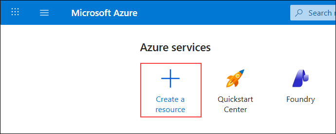
  
1. In the search bar, enter **Azure Kubernetes Service aks (1)** and select **azure kubernetes service aks (2)** from the results.

    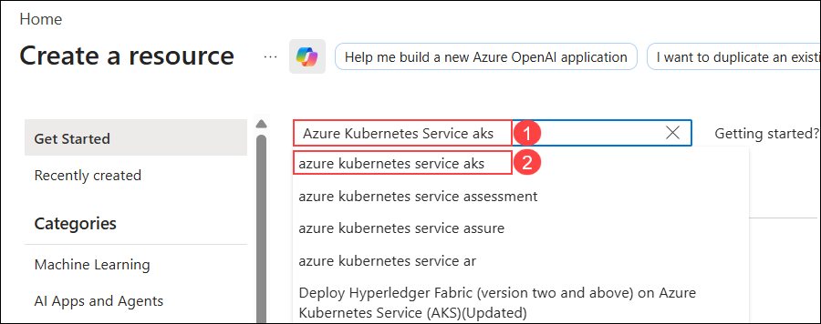

1. From the results, select **Create (1)** under **Azure Kubernetes Service (AKS) (2)**.

    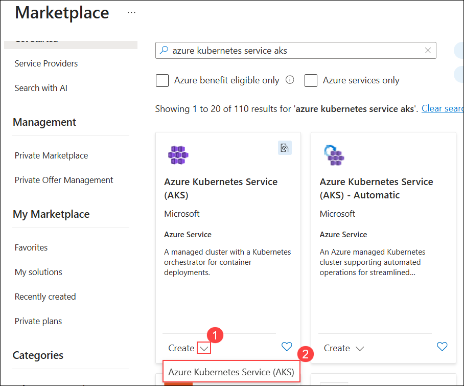

1. On the **Basics** tab of **Create Kubernetes Cluster**, configure the following options and leave all other settings as default and click on **Next** **(12)**. 

    - **Subscription**: Select Avaiable Subscription **(1)**.
    - **Resource group**: Select **<inject key="resourcegroup" enableCopy="false"/>** **(2)**.
    - **Cluster preset configuration**: Select `Dev/Test` **(3)**.
    - **Kubernetes cluster name**: Enter **myAKSCluster-<inject key="DeploymentID"  enableCopy="false"/>** **(4)**.
    - **Region**: **<inject key="region"  enableCopy="false"/>** **(5)**.
    - **Fleet Manager**: Select `None` **(6)**.
    - **Availability zones**: Select `None` **(7)**.
    - **AKS pricing tier**: Select `free` **(8)**.
    - **Kubernetes Version**: Leave it to `default` version **(9)**.
    - **Node security channel type**: Select **Node image** **(10)**.
    - **Authentication and authorization**: Leave the setting set to `Local accounts with Kubernetes RBAC` **(11)**.

        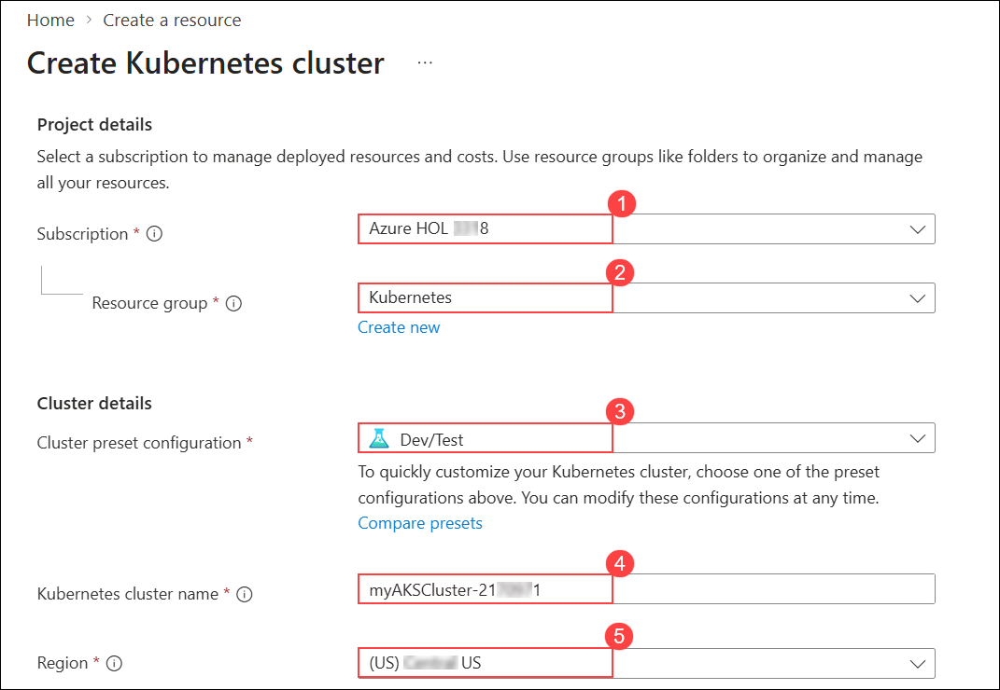

        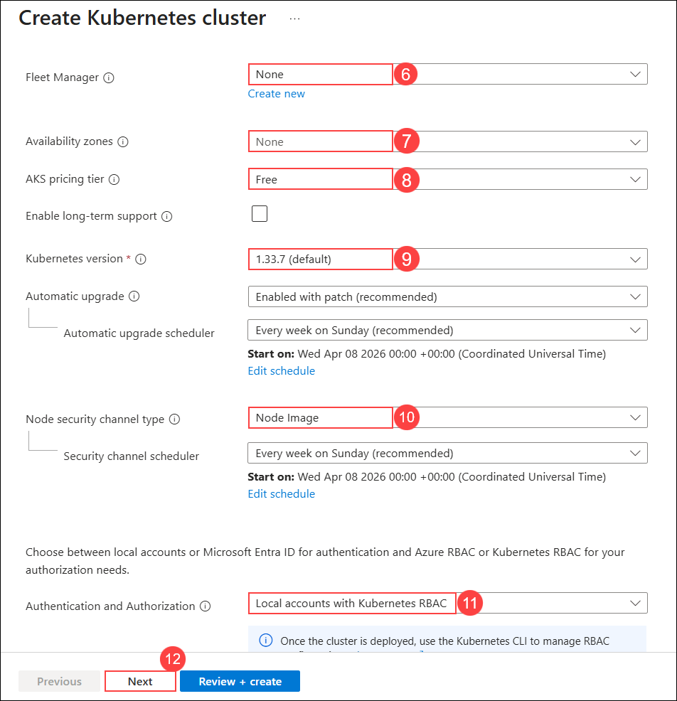

1. On the **Node pools** tab, select **agentpool** **(1)** node pool, click on **Delete** **(2)**.

    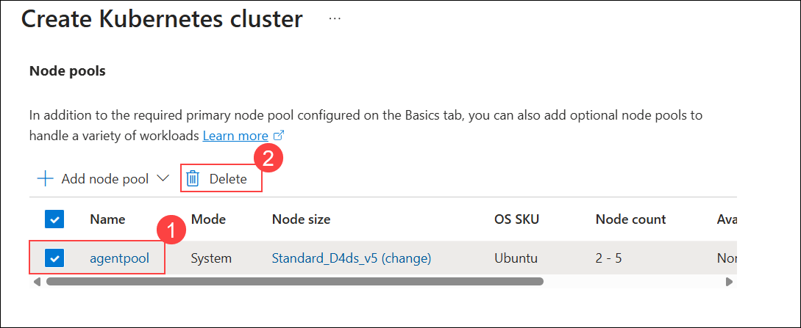
  
1. In the **Node pools** tab, select **Add node pool (1)** and choose **Add a Virtual Machine Scale Set node pool (2)**.

    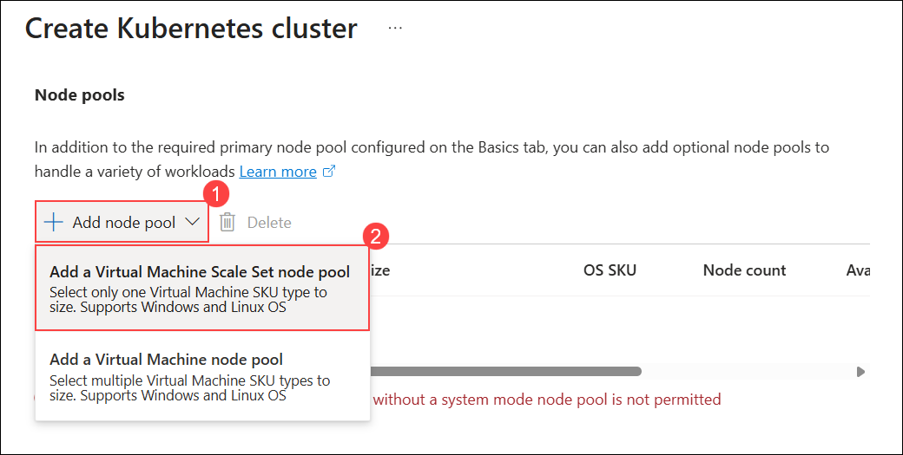

1. Enter the following detils in **Update node pool** tab and click on **Add** **(7)**.

    - **Node pool name**: Enter node name as `nplinux` **(1)**.
    - **Mode**: Select `System` **(2)**
    - **OS SKU**: select `Ubuntu Linux` **(3)**.
    - **Availability zones**: setting to `None` **(4)**.
  
        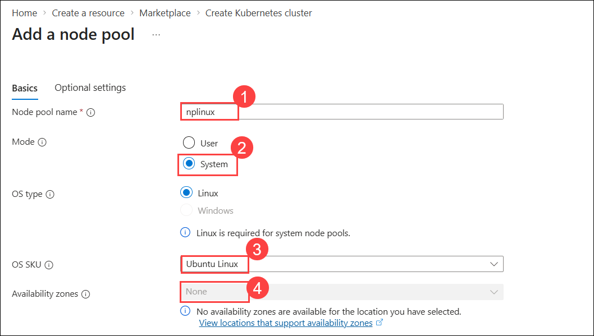
  
1. In the **Add a node pool** tab, select **Choose a size**.

    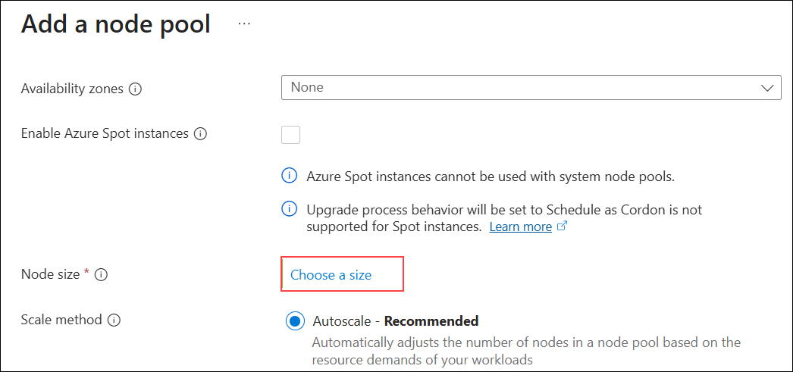

1. In the **Select a VM size** pane, enter **D2s_v3 (1)** in the search bar, expand **D-Series v3 (2)**, select **D2s_v3 (3)**, and then click **Select (4)**.

    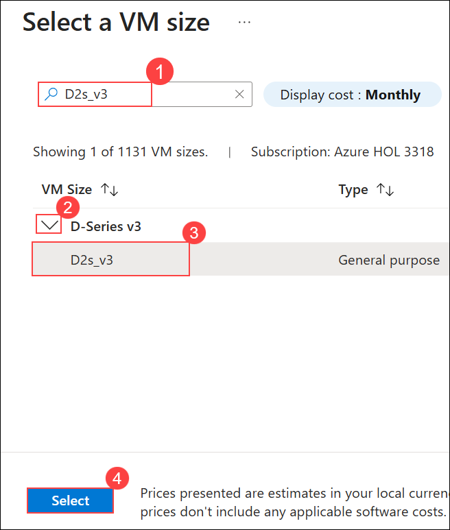

1. In the **Add a node pool** tab, ensure **Autoscale - Recommended (1)** is selected, and then click **Add (2)**.

    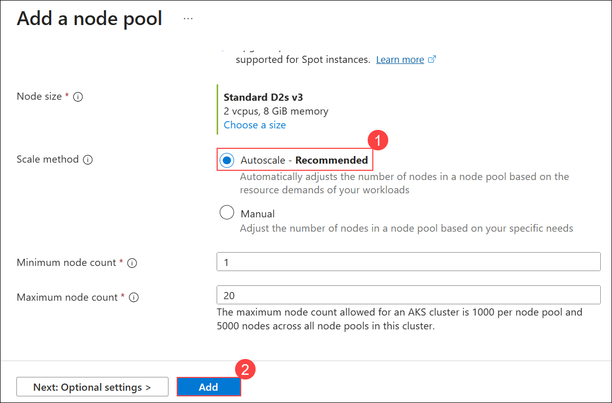

1. In the **Node pools** tab, verify the node pool configuration and select **Review + create**.

    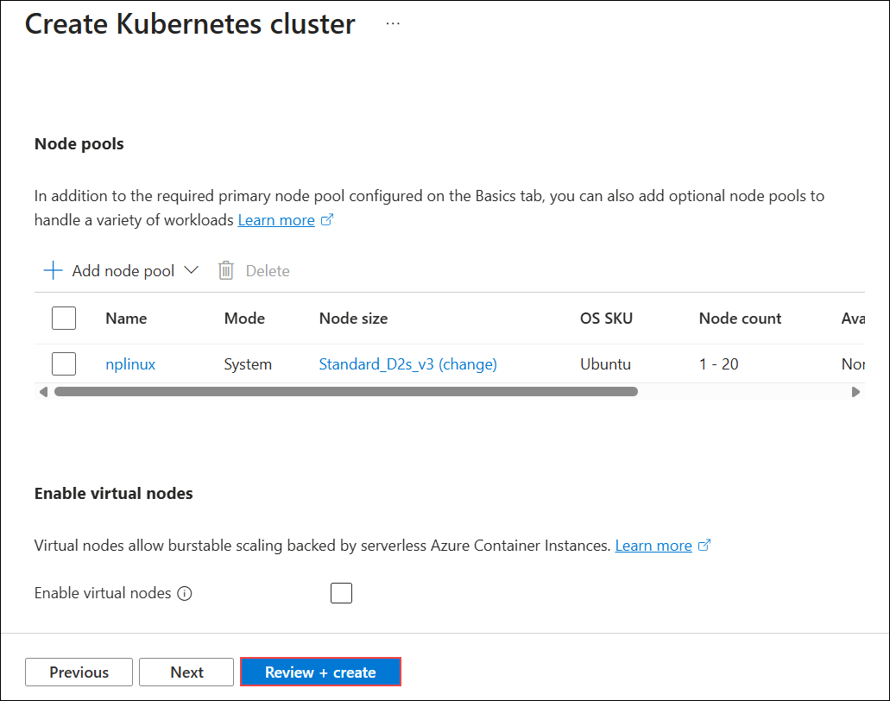

1. On the **Review + create** tab, verify the configuration and select **Create**.

    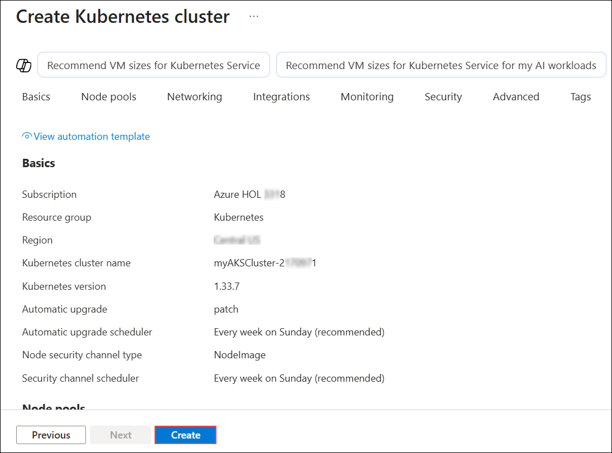

    > **Note**: The Deployment will take 5 to 10 minutes to create the AKS cluster, so you can proceed to the next exercise.

### Exercise 2: Connect to the Cluster

In this exercise, we connect to an AKS cluster. We start by opening the Cloud Shell in the Azure portal, selecting PowerShell, and setting up a storage account if necessary. We then configure the connection to our Kubernetes cluster and verify it by checking the cluster nodes to ensure they are ready.

1. In the Azure portal, click on **Cloud Shell**

      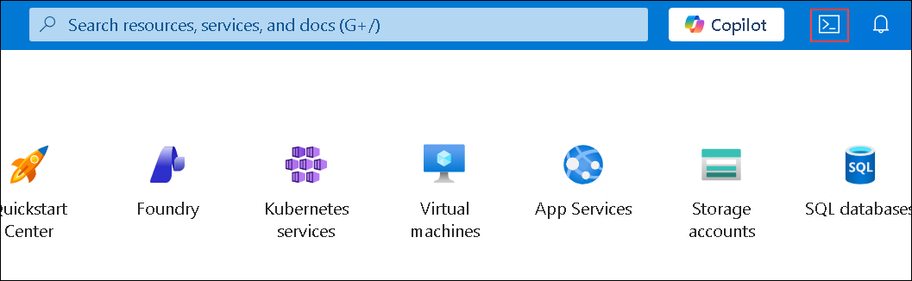

1. Now select `PowerShell`.

      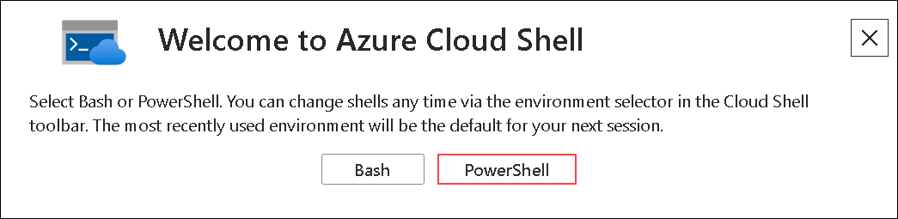

1. Select **Mount storage account (1)**, choose the default subscription **(2)**, and click **Apply (3)**.

      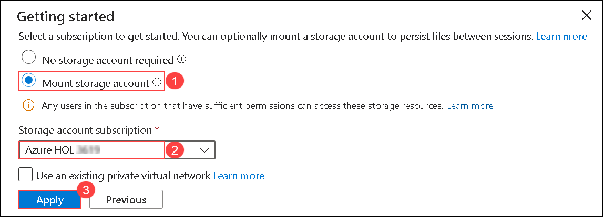

1. Select **I want to create a storage account (1)** and click **Next (2).**

      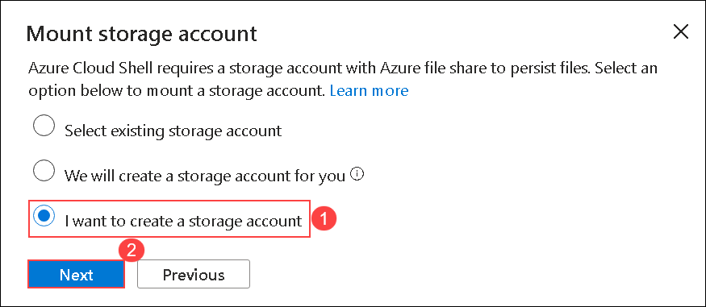


1. Provide all the details below. Click on **Create**.

      - **Resource group**: Select the **<inject key="resourcegroup" enableCopy="false"/>**  Resource group.
      - **Region**: **<inject key="region"  enableCopy="false"/>**.
      - **Storage account**: Enter the name as **storage<inject key="DeploymentID"  enableCopy="false"/>** .
      - **File share**: Enter `blob` 

        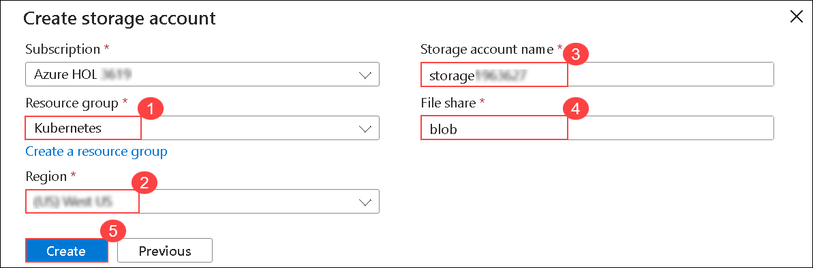

1. Configure `kubectl` to connect to your Kubernetes cluster using the `Import-AzAksCredential` cmdlet. This command downloads credentials and configures the Kubernetes CLI to use them.

      ```
      Import-AzAksCredential -ResourceGroupName <resouresegroupname> -Name <myAKSClustername>
      ```

      > **Note**: Replace `<resouresegroupname>` with **<inject key="resourcegroup" enableCopy="true"/>**  and `<myAKSClustername>` with **myAKSCluster-<inject key="DeploymentID"  enableCopy="true"/>**.

1. Confirm, do you want to import the Kubernetes config? Type `y` and press `Enter`.

      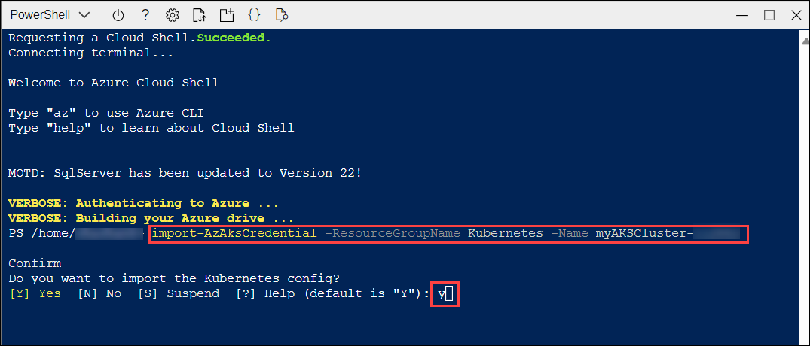

1. Verify the connection to your cluster using `kubectl` to return the cluster nodes.

      ```
      kubectl get nodes
      ```

      > The following example output shows the single node created in the previous steps. Make sure the node status is Ready.

      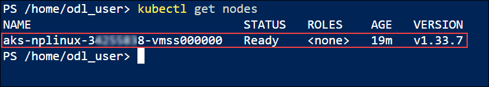

### Exercise 3: Deploy the application

In this exercise, we deploy an application to an AKS cluster using a Kubernetes manifest file. To deploy the application, you use a manifest file to create all the objects required to run the AKS Store application. A Kubernetes manifest file defines a cluster's desired state, such as which container images to run. The manifest includes the following Kubernetes deployments and services:

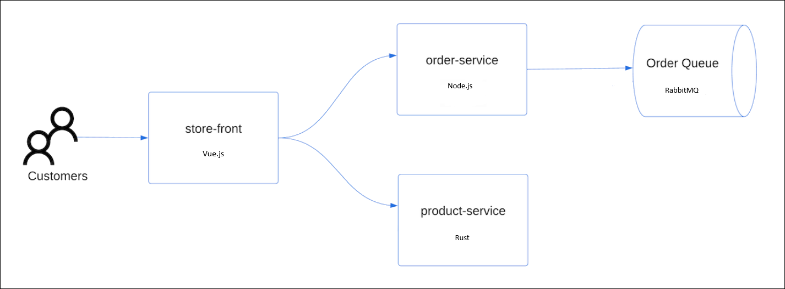

- **Store front**: Web application for customers to view products and place orders.
- **Product service**: Shows product information.
- **Order service**: Places orders.
- **Rabbit MQ**: Message queue for an order queue.

1. Create a file named `aks-store-quickstart.yaml` by running the command below.

    ```
    code aks-store-quickstart.yaml
    ```
1. After running the command, a pop-up window will show up. click on **confirm**. It will take you to the classic PowerShell terminal.
 
     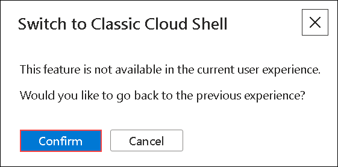

1. Run the command below again, and it will open the code editor.

   ```
   code aks-store-quickstart.yaml
   ```
   
1. Copy and paste the following manifest into the editor:

    ```yaml
    apiVersion: apps/v1
    kind: Deployment
    metadata:
      name: rabbitmq
    spec:
      replicas: 1
      selector:
        matchLabels:
          app: rabbitmq
      template:
        metadata:
          labels:
            app: rabbitmq
        spec:
          nodeSelector:
            "kubernetes.io/os": linux
          containers:
          - name: rabbitmq
            image: mcr.microsoft.com/mirror/docker/library/rabbitmq:3.10-management-alpine
            ports:
            - containerPort: 5672
              name: rabbitmq-amqp
            - containerPort: 15672
              name: rabbitmq-http
            env:
            - name: RABBITMQ_DEFAULT_USER
              value: "username"
            - name: RABBITMQ_DEFAULT_PASS
              value: "password"
            resources:
              requests:
                cpu: 10m
                memory: 128Mi
              limits:
                cpu: 250m
                memory: 256Mi
            volumeMounts:
            - name: rabbitmq-enabled-plugins
              mountPath: /etc/rabbitmq/enabled_plugins
              subPath: enabled_plugins
          volumes:
          - name: rabbitmq-enabled-plugins
            configMap:
              name: rabbitmq-enabled-plugins
              items:
              - key: rabbitmq_enabled_plugins
                path: enabled_plugins
    ---
    apiVersion: v1
    data:
      rabbitmq_enabled_plugins: |
        [rabbitmq_management,rabbitmq_prometheus,rabbitmq_amqp1_0].
    kind: ConfigMap
    metadata:
      name: rabbitmq-enabled-plugins
    ---
    apiVersion: v1
    kind: Service
    metadata:
      name: rabbitmq
    spec:
      selector:
        app: rabbitmq
      ports:
        - name: rabbitmq-amqp
          port: 5672
          targetPort: 5672
        - name: rabbitmq-http
          port: 15672
          targetPort: 15672
      type: ClusterIP
    ---
    apiVersion: apps/v1
    kind: Deployment
    metadata:
      name: order-service
    spec:
      replicas: 1
      selector:
        matchLabels:
          app: order-service
      template:
        metadata:
          labels:
            app: order-service
        spec:
          nodeSelector:
            "kubernetes.io/os": linux
          containers:
          - name: order-service
            image: ghcr.io/azure-samples/aks-store-demo/order-service:latest
            ports:
            - containerPort: 3000
            env:
            - name: ORDER_QUEUE_HOSTNAME
              value: "rabbitmq"
            - name: ORDER_QUEUE_PORT
              value: "5672"
            - name: ORDER_QUEUE_USERNAME
              value: "username"
            - name: ORDER_QUEUE_PASSWORD
              value: "password"
            - name: ORDER_QUEUE_NAME
              value: "orders"
            - name: FASTIFY_ADDRESS
              value: "0.0.0.0"
            resources:
              requests:
                cpu: 1m
                memory: 50Mi
              limits:
                cpu: 75m
                memory: 128Mi
          initContainers:
          - name: wait-for-rabbitmq
            image: busybox
            command: ['sh', '-c', 'until nc -zv rabbitmq 5672; do echo waiting for rabbitmq; sleep 2; done;']
            resources:
              requests:
                cpu: 1m
                memory: 50Mi
              limits:
                cpu: 75m
                memory: 128Mi
    ---
    apiVersion: v1
    kind: Service
    metadata:
      name: order-service
    spec:
      type: ClusterIP
      ports:
      - name: http
        port: 3000
        targetPort: 3000
      selector:
        app: order-service
    ---
    apiVersion: apps/v1
    kind: Deployment
    metadata:
      name: product-service
    spec:
      replicas: 1
      selector:
        matchLabels:
          app: product-service
      template:
        metadata:
          labels:
            app: product-service
        spec:
          nodeSelector:
            "kubernetes.io/os": linux
          containers:
          - name: product-service
            image: ghcr.io/azure-samples/aks-store-demo/product-service:latest
            ports:
            - containerPort: 3002
            resources:
              requests:
                cpu: 10m
                memory: 64Mi
              limits:
                cpu: 100m
                memory: 128Mi
    ---
    apiVersion: v1
    kind: Service
    metadata:
      name: product-service
    spec:
      type: ClusterIP
      ports:
      - name: http
        port: 3002
        targetPort: 3002
      selector:
        app: product-service
    ---
    apiVersion: apps/v1
    kind: Deployment
    metadata:
      name: store-front
    spec:
      replicas: 1
      selector:
        matchLabels:
          app: store-front
      template:
        metadata:
          labels:
            app: store-front
        spec:
          nodeSelector:
            "kubernetes.io/os": linux
          containers:
          - name: store-front
            image: ghcr.io/azure-samples/aks-store-demo/store-front:latest
            ports:
            - containerPort: 8080
              name: store-front
            env:
            - name: VUE_APP_ORDER_SERVICE_URL
              value: "http://order-service:3000/"
            - name: VUE_APP_PRODUCT_SERVICE_URL
              value: "http://product-service:3002/"
            resources:
              requests:
                cpu: 1m
                memory: 200Mi
              limits:
                cpu: 1000m
                memory: 512Mi
    ---
    apiVersion: v1
    kind: Service
    metadata:
      name: store-front
    spec:
      ports:
      - port: 80
        targetPort: 8080
      selector:
        app: store-front
      type: LoadBalancer
    ```

      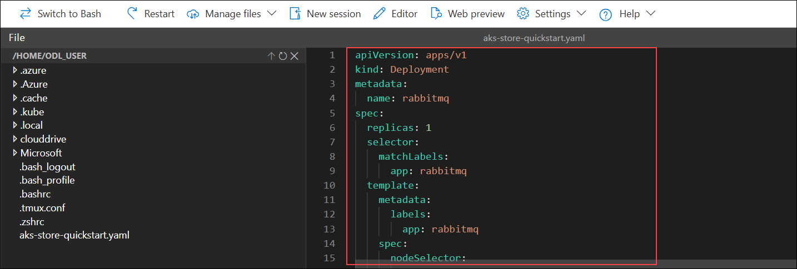

1. **Save** the file by pressing **Ctrl+S** and close the file.

1. Deploy the application using the `kubectl apply` command and specify the name of your YAML manifest:

    ```console
    kubectl apply -f aks-store-quickstart.yaml
    ```

    The following example output shows the deployments and services:

    ```output
    deployment.apps/rabbitmq created
    service/rabbitmq created
    deployment.apps/order-service created
    service/order-service created
    deployment.apps/product-service created
    service/product-service created
    deployment.apps/store-front created
    service/store-front created
    ```

      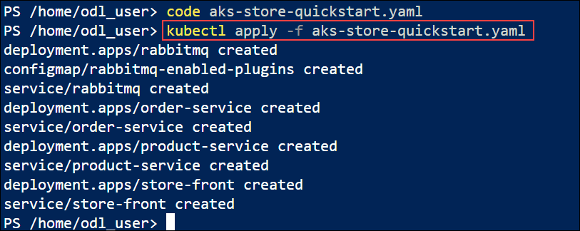

### Exercise 4: Test the application

In this exercise, we test the deployed AKS application by ensuring it is running properly. First, we check the status of the pods to confirm they are running. Next, we monitor the service to get the public IP address of the storefront application. Once the public IP is available, we open a web browser to this IP address to access and view the Azure Store app in action. When the application runs, a Kubernetes service exposes the application's front end to the internet. This process can take a few minutes to complete.

1. Check the status of the deployed pods using the [kubectl get pods][kubectl-get] command. Make sure all pods are `Running` before proceeding.

    ```console
    kubectl get pods
    ```

    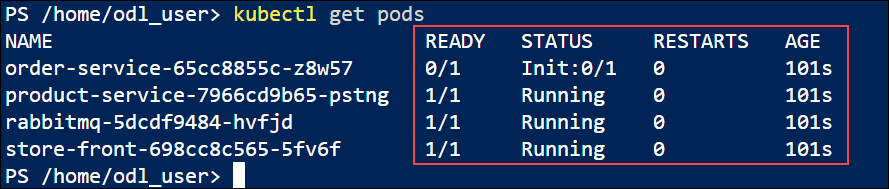

1. Check for a public IP address for the storefront application. Monitor progress using the [kubectl get service][kubectl-get] command with the `--watch` argument.

    ```azurecli
    kubectl get service store-front --watch
    ```

    The **EXTERNAL-IP** output for the `store-front` service initially shows as *pending*:

    ```output
    NAME          TYPE           CLUSTER-IP    EXTERNAL-IP   PORT(S)        AGE
    store-front   LoadBalancer   10.0.100.10   <pending>     80:30025/TCP   4h4m
    ```

    Once the **EXTERNAL-IP** address changes from *pending* to an actual public IP address, use `CTRL-C` to stop the `kubectl` watch process.

      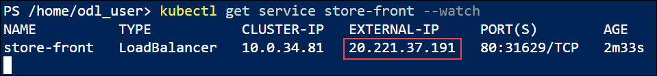

    The following example output shows a valid public IP address assigned to the service:

    ```output
    NAME          TYPE           CLUSTER-IP    EXTERNAL-IP    PORT(S)        AGE
    store-front   LoadBalancer   10.0.100.10   20.62.159.19   80:30025/TCP   4h5m
    ```

1. Open a web browser to the external IP address of your service to see the Azure Store app in action.

      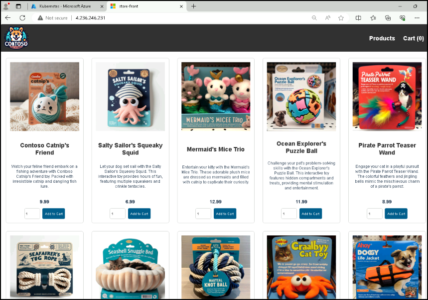

> Result: You have deployed an Azure Kubernetes Cluster

## Review
In this lab, you will complete the following tasks:
- Created an AKS cluster
- Connected to the cluster
- Deployed the application
- Tested the application

## You have successfully completed the lab.
