# Lab 02: Network Security Groups and Application Security Groups

## Lab scenario
You have been asked to implement your organization's virtual networking infrastructure and test to ensure it is working correctly. In particular:

- The organization has two groups of servers: Web Servers and Management Servers.
- Each group of servers should be in its own Application Security Group. 
- You should be able to RDP into the Management Servers, but not the Web Servers.
- The Web Servers should display the IIS web page when accessed from the internet. 
- Network security group rules should be used to control network access.  

 > For all the resources in this lab, we are using the **East US** region. Verify with your instructor this is the region to use for class. 

## Lab objectives
In this lab, you will complete the following exercises:
- Exercise 1: Create the virtual networking infrastructure
- Exercise 2: Deploy virtual machines and test the network filters

## Estimated timing: 45 minutes

## Architecture Diagram


# Exercise 1: Create the virtual networking infrastructure

## Estimated timing: 20 minutes

In this exercise, you will complete the following tasks:

- Task 1: Create a virtual network with one subnet.
- Task 2: Create two application security groups.
- Task 3: Create a network security group and associate it with the virtual network subnet.
- Task 4: Create inbound NSG security rules to all traffic to web servers and RDP to the management servers.

## Task 1:  Create a virtual network

In this task, you will create a virtual network to use with the network and application security groups. 

1. On the Azure portal locate the search bar at the top of the page. Search for **Virtual networks**, select the search result for **Virtual networks**.

1. On the **Virtual networks** blade, click **+ Create**.

1. On the **Basics** tab of the **Create virtual network** blade, specify the following settings (leave others with their default values) and click **Next: IP Addresses**:

    |Setting|Value|
    |---|---|
    |Subscription|the name of the Azure subscription you are using in this lab|
    |Resource group|click **Create new** and type the name **AZ500LAB02**|
    |Name|**myVirtualNetwork**|
    |Region|**East US**|

    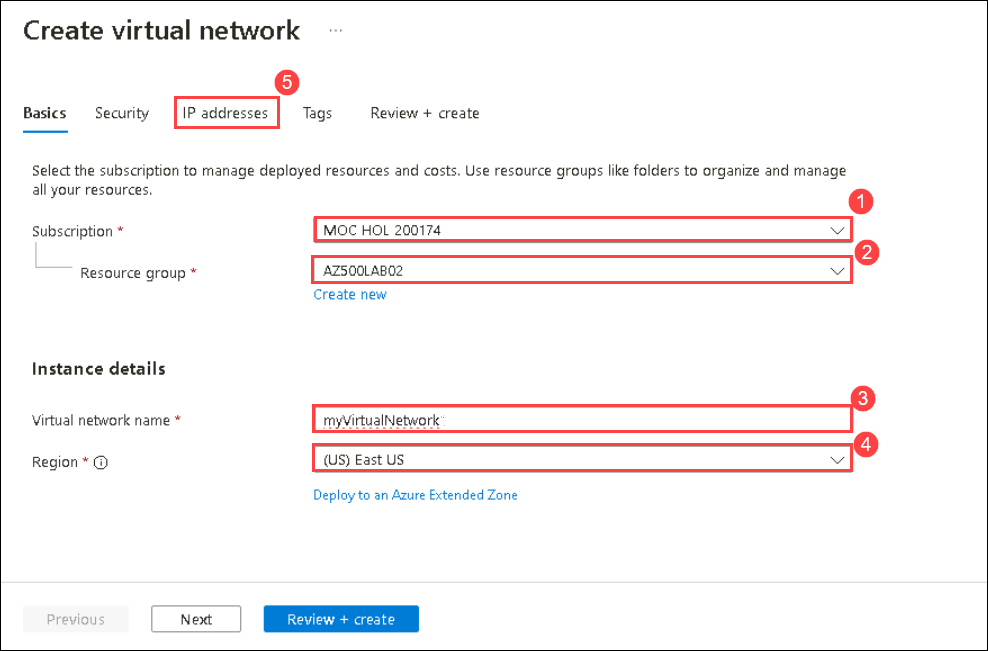

1. On the **IP addresses** tab of the **Create virtual network** blade, set the **IPv4 address space** to **10.0.0.0/16**, and, if needed, in the **Subnet name** column, click **default**, on the **Edit subnet** blade, specify the following settings and click **Save**:

    |Setting|Value|
    |---|---|
    |Subnet name|**default**|
    |Subnet address range|**10.0.0.0/24**|

    >**Note:** If the **default** subnet is not there in the subnet section, then you have to create it. Click on **+ Add subnet**, then follow this given instructions, and click on **Add**.

1. Back on the **IP addresses** tab of the **Create virtual network** blade, click **Review + create**.

   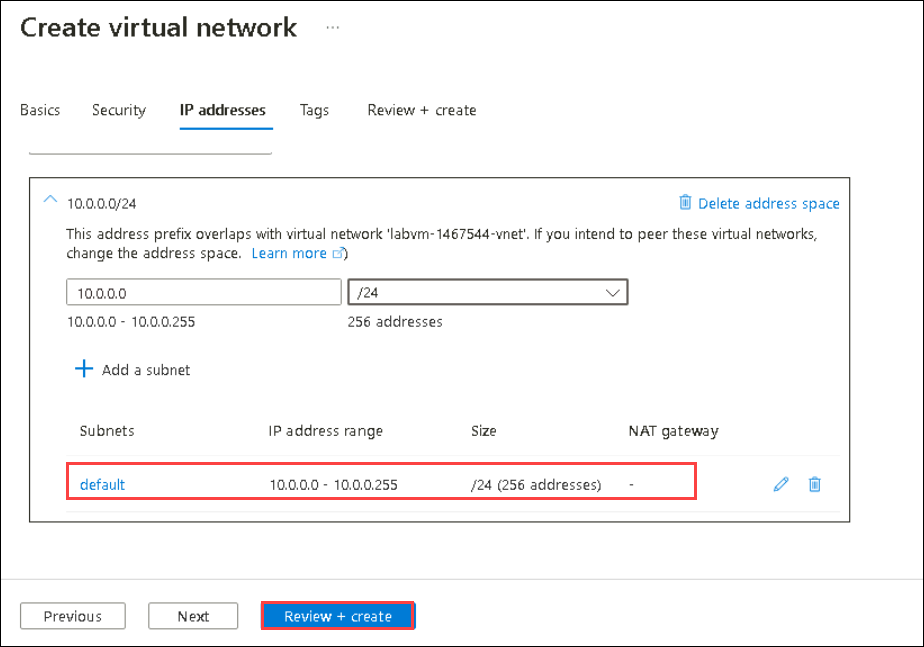

1. On the **Review + create** tab of the **Create virtual network** blade, click **Create**.

## Task 2:  Create application security groups

In this task, you will create an application security group.

1. On the Azure portal locate the search bar at the top of the page, and search for **Application security groups** select the search result for **Application security groups**.

1. On the **Application security groups** blade, click **+ Create**.

1. On the **Basics** tab of the **Create an application security group** blade, specify the following settings: 

    |Setting|Value|
    |---|---|
    |Resource group|**AZ500LAB02**|
    |Name|**myAsgWebServers**|
    |Region|**East US**|

    >**Note**: This group will be for the web servers.

1. Click **Review + create** and then click **Create**.

   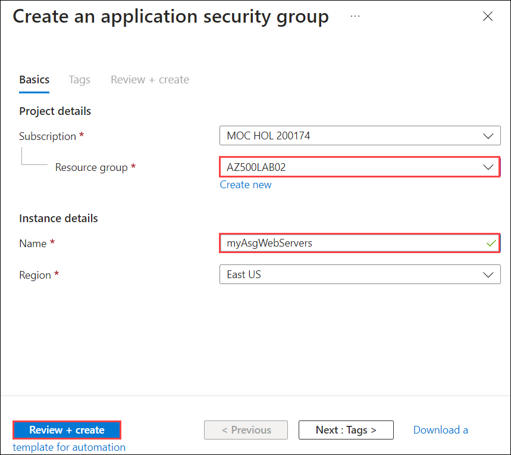

1. Navigate back to the **Application security groups** blade and click **+ Create**.

1. On the **Basics** tab of the **Create an application security group** blade, specify the following settings: 

    |Setting|Value|
    |---|---|
    |Resource group|**AZ500LAB02**|
    |Name|**myAsgMgmtServers**|
    |Region|**East US**|

    >**Note**: This group will be for the management servers.

1. Click **Review + create** and then click **Create**.

   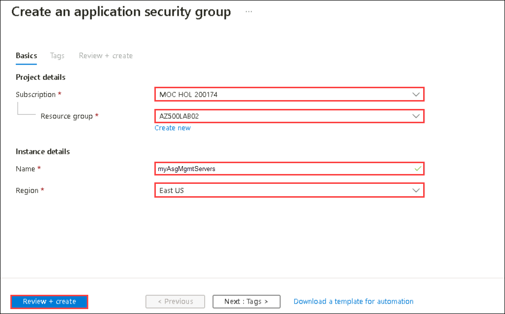

## Task 3:  Create a network security group and associate the NSG to the subnet

In this task, you will create a network security group. 

1. On the Azure portal locate the search bar at the top of the page search for **Network security groups**, select the search result for **Network security groups**.

1. On the **Network security groups** blade, click **+ Create**.

1. On the **Basics** tab of the **Create network security group** blade, specify the following settings: 

    |Setting|Value|
    |---|---|
    |Subscription|the name of the Azure subscription you are using in this lab|
    |Resource group|**AZ500LAB02**|
    |Name|**myNsg**|
    |Region|**East US**|

1. Click **Review + create** and then click **Create**.

    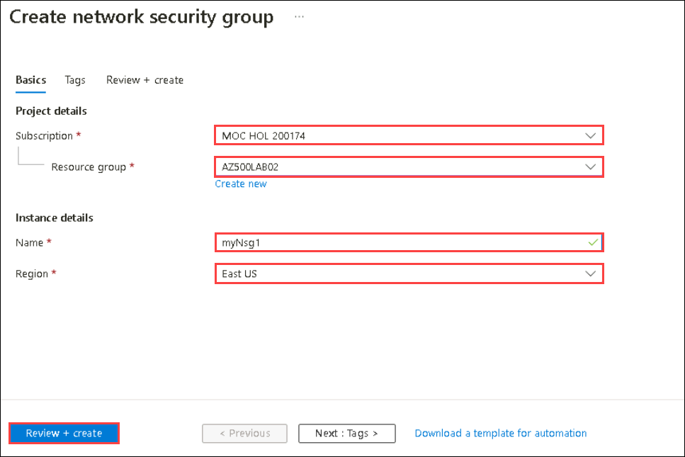

1. After deployment succeeded, click on **Go to resources**.

1. On the **myNsg** blade, in the **Settings** section, click **Subnets** and then click **+ Associate**. 

1. On the **Associate subnet** blade, specify the following settings and click **OK**:

    |Setting|Value|
    |---|---|
    |Virtual network|**myVirtualNetwork**|
    |Subnet|**default**|
    
    

## Task 4: Create inbound NSG security rules to all traffic to web servers and RDP to the servers. 

1. On the **myNsg** blade, in the **Settings** section, click **Inbound security rules**.

1. Review the default inbound security rules and then click **+ Add**.

1. On the **Add inbound security rules** blade, specify the following settings to allow TCP ports 80 and 443 to the **myAsgWebServers** application security group (leave all other values with their default values): 

    |Setting|Value|
    |---|---|
    |Destination|in the drop-down list, select **Application security group** and then click **myAsgWebServers**|
    |Destination port ranges|**80,443**|
    |Protocol|**TCP**|
    |Priority|**100**|                                                    
    |Name|**Allow-Web-All**|

1. On the **Add inbound security rules** blade, click **Add** to create the new inbound rule. 

   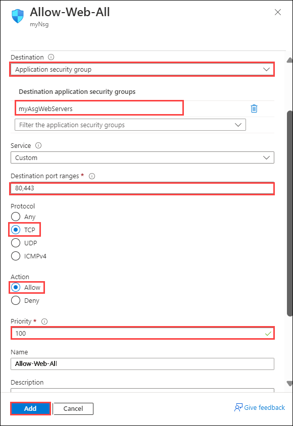

1. On the **myNsg** blade, in the **Settings** section, click **Inbound security rules**, and then click **+ Add**.

1. On the **Add inbound security rules** blade, specify the following settings to allow the RDP port (TCP 3389) to the **myAsgMgmtServers** application security group (leave all other values with their default values): 

    |Setting|Value|
    |---|---|
    |Destination|in the drop-down list, select **Application security group** and then click **myAsgMgmtServers**|
    |Destination port ranges|**3389**|
    |Protocol|**TCP**|
    |Priority|**110**|                                                    
    |Name|**Allow-RDP-All**|

1. On the **Add inbound security rule** blade, click **Add** to create the new inbound rule. 

   

> Result: You have deployed a virtual network, network security with inbound security rules, and two application security groups. 

# Exercise 2: Deploy virtual machines and test network filters

### Estimated timing: 25 minutes

In this exercise, you will complete the following tasks:

- Task 1: Create a virtual machine to use as a web server.
- Task 2: Create a virtual machine to use as a management server. 
- Task 3: Associate each virtual machines network interface to it's application security group.
- Task 4: Test the network traffic filtering.

## Task 1: Create a virtual machine to use as a web server.

In this task, you will create a virtual machine to use as a web server.

1. In the Azure portal, in the **Search resources, services, and docs** text box at the top of the Azure portal page, type **Virtual machines** and press the **Enter** key.

1. On the **Virtual machines** blade, click **+ Create** and, in the dropdown list, click **+ Azure Virtual machine**.

1. On the **Basics** tab of the **Create a virtual machine** blade, specify the following settings (leave others with their default values):

   |Setting|Value|
   |---|---|
   |Subscription|the name of the Azure subscription you will be using in this lab|
   |Resource group|**AZ500LAB02**|
   |Virtual machine name|**myVmWeb**|
   |Region|**(US)East US**|

    
    
   |Setting|Value|
   |---|---|
   |Image|**Windows Server 2022 Datacenter: Azure Edition- Gen2**|
   |Size|**Standard D2s v3**|

     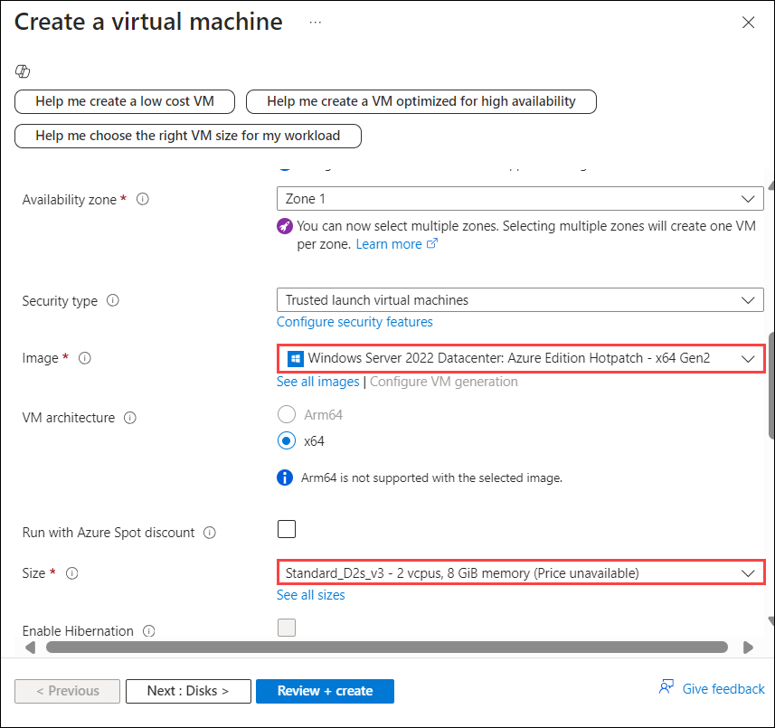

   |Setting|Value|
   |---|---|
   |Username|**Student**|
   |Password|**Pa55w.rd1234**|
   |Public inbound ports|**None**|

    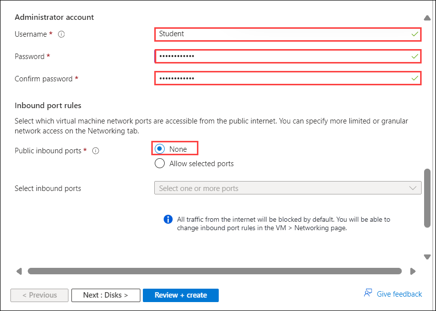
 
   |Setting|Value|
   |---|---|
   |Would you like to use an existing Windows Server License |**No**|
   |I confirm I have an eligible Windows Server license with Software Assurance or Windows Server subscription to apply this Azure Hybrid Benefit| **Check the box**|

    >**Note**: For public inbound ports, we will rely on the precreated NSG. 

1. Click **Next: Disks >** and, on the **Disks** tab of the **Create a virtual machine** blade, set the **OS disk type** to **Standard HDD** and click **Next: Networking >**.

   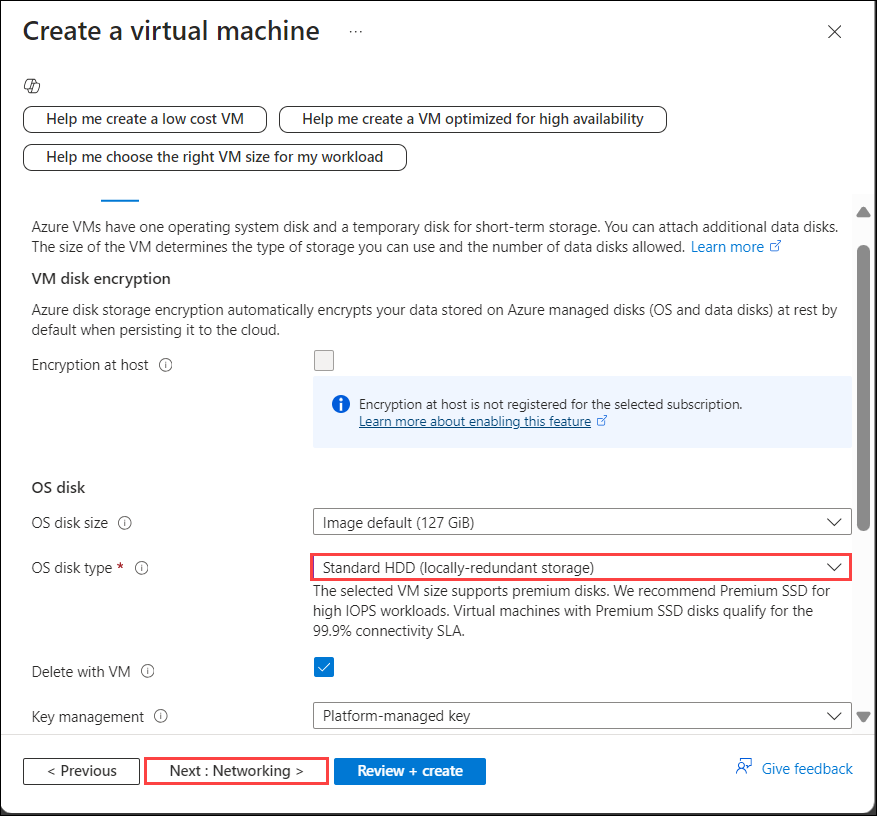

1. On the **Networking** tab of the **Create a virtual machine** blade, select the previously created network **myVirtualNetwork**.

1. Under **NIC network security group** select **None**.

1. Click **Next: Management >** , then click **Next: Monitoring>** on the **Monitoring** tab of the **Create a virtual machine** blade, verify the following setting:

   |Setting|Value|
   |---|---|
   |Boot diagnostics|**Enabled with managed storage account (recommended)**|

1. Click **Review + create**, on the **Review + create** blade, ensure that validation was successful and click **Create**.

## Task 2: Create a virtual machine to use as a management server. 

In this task, you will create a virtual machine to use as a management server.

1. In the Azure portal, navigate back to the **Virtual machines** blade, click **+ Create**, and, in the dropdown list, click **+ Azure Virtual machine**.

1. On the **Basics** tab of the **Create a virtual machine** blade, specify the following settings (leave others with their default values):

   |Setting|Value|
   |---|---|
   |Subscription|the name of the Azure subscription you will be using in this lab|
   |Resource group|**AZ500LAB02**|
   |Virtual machine name|**myVMMgmt**|
   |Region|(US)East US|
   |Image|**Windows Server 2022 Datacenter: Azure Edition- Gen2**|
   |Size|**Standard D2s v3**|
   |Username|**Student**|
   |Password|**Pa55w.rd1234**|
   |Public inbound ports|**None**|
   |Would you like to use an existing Windows Server License|**No**|
   |I confirm I have an eligible Windows Server license with Software Assurance or Windows Server subscription to apply this Azure Hybrid Benefit| |**Check the box**|

    >**Note**: For public inbound ports, we will rely on the precreated NSG. 

1. Click **Next: Disks >** and, on the **Disks** tab of the **Create a virtual machine** blade, set the **OS disk type** to **Standard HDD** and click **Next: Networking >**.

1. On the **Networking** tab of the **Create a virtual machine** blade, select the previously created network **myVirtualNetwork**.

1. Under **NIC network security group** select **None**.

1. Click **Next: Management >**, then click **Next: Monitoring >** on the **Monitoring** tab of the **Create a virtual machine** blade, verify the following setting:

   |Setting|Value|
   |---|---|
   |Boot diagnostics|**Enabled with managed storage account (recommended)**|

1. Click **Review + create**, on the **Review + create** blade, ensure that validation was successful and click **Create**.

    >**Note**: Wait for both virtual machines to be provisioned before continuing. 

## Task 3: Associate each virtual machines network interface to its application security group.

In this task, you will associate each virtual machine's network interface with the corresponding application security group. The myVmWeb virtual machine interface will be associated to the myAsgWebServers ASG. The myVMMgmt virtual machine interface will be associated to the myAsgMgmtServers ASG. 

1. In the Azure portal, navigate back to the **Virtual machines** blade and verify that both virtual machines are listed with the **Running** status.

1. In the list of virtual machines, click the **myVmWeb** entry.

1. On the **myVmWeb** blade, in the **Settings** section, click **Networking** and then, on the **myVmWeb \| Networking** blade, click the **Application security groups** tab.

   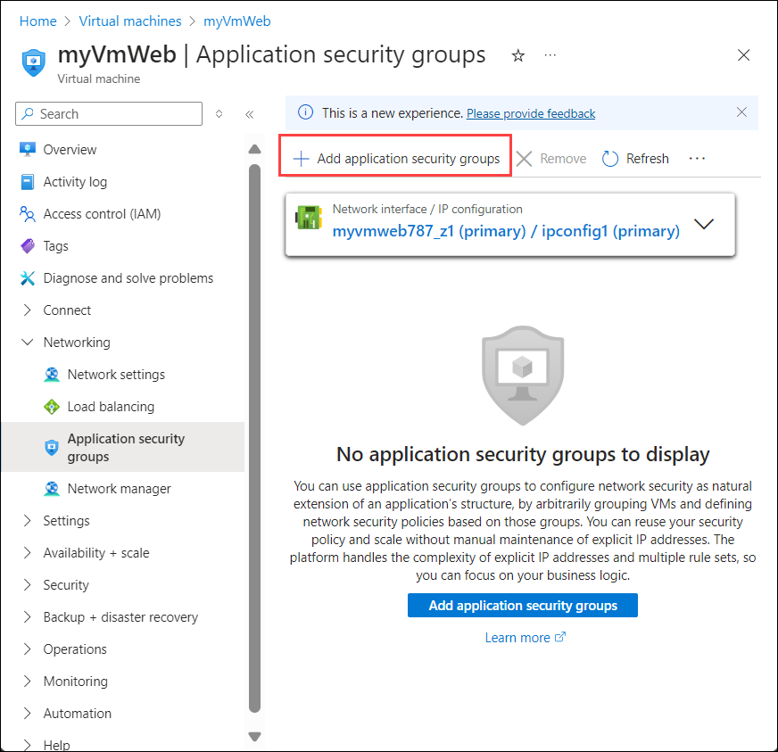

1. Click **Configure the application security groups**, in the **Application security group** drop-down list, select **myAsgWebServers**, and then click **Add**.

   

1. Navigate back to the **Virtual machines** blade and in the list of virtual machines, click the **myVMMgmt** entry.

1. On the **myVMMgmt** blade, in the **Settings** section, click **Networking** and then, on the **myVMMgmt \| Networking** blade, click the **Application security groups** tab.

1. Click + **Add application security groups**, in the **Application security group** list, select **myAsgMgmtServers**, and then click **Save**.

## Task 4: Test the network traffic filtering

In this task, you will test the network traffic filters. You should be able to RDP into the myVMMgmnt virtual machine. You should be able to connect from the internet to the myVmWeb virtual machine and view the default IIS web page.  

1. Navigate back to the **myVMMgmt** virtual machine blade.

1. On the **myVMMgmt** blade, click **Connect** . 

   

1. Click **RDP** then **Download RDP File**.

   

2. Open that file and use it to connect to the **myVMMgmt** Azure VM via Remote Desktop. When prompted to authenticate, provide the following credentials, after providing the credentials, click on **Yes**:

   |Setting|Value|
   |---|---|
   |User name|**Student**|
   |Password|**Pa55w.rd1234**|

    >**Note**: Verify that the Remote Desktop connection was successful. At this point you have confirmed you can connect via Remote Desktop to myVMMgmt.

1. In the Azure portal, navigate to the **myVmWeb** virtual machine blade.

1. On the **myVmWeb** blade, in the **Operations** section, click **Run command** and then click **RunPowerShellScript**.

1. On the **Run Command Script** pane, run the following to install the Web server role on **myVmWeb**:

    ```powershell
    Install-WindowsFeature -name Web-Server -IncludeManagementTools
    ```

     

    >**Note**: Wait for the installation to complete. This might take a couple of minutes. At that point, you can verify that myVmWeb can be accessed via HTTP/HTTPS.

1. After getting the output, close the **Run Command Script** blade, and navigate back to the overview page of **myVmWeb** blade.

1. Identify the **Public IP address** of the myVmWeb Azure VM.

1. Open another browser tab and navigate to IP address you identified in the previous step.

   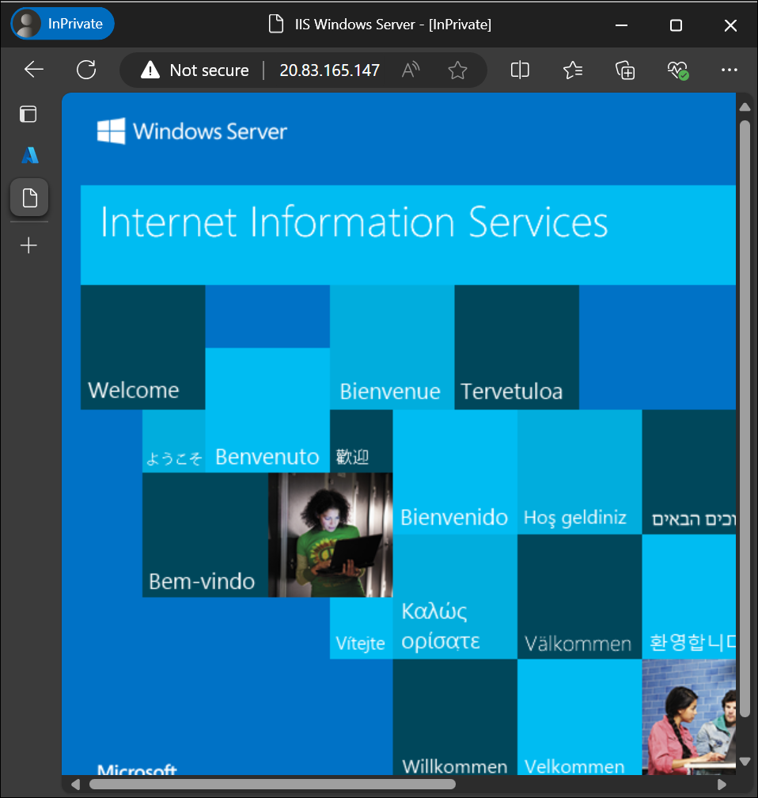

    >**Note**: The browser page should display the default IIS welcome page because port 80 is allowed inbound from the internet based on the setting of the **myAsgWebServers** application security group. The network interface of the myVmWeb Azure VM is associated with that application security group. 

> **Result:** You have validated that the NSG and ASG configuration is working and traffic is being correctly managed.

> **Congratulations** on completing the task! Now, it's time to validate it. Here are the steps:
   - If you receive a success message, you can proceed to the next task.
   - If not, carefully read the error message and retry the step, following the instructions in the lab guide.
   - If you need any assistance, please contact us at cloudlabs-support@spektrasystems.com. We are available 24/7 to help you out.
 
   <validation step="63a375cc-ae94-418b-a78c-4561f35ff40d" />

**You have successfully completed the lab**
