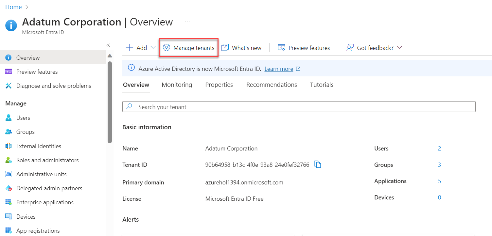
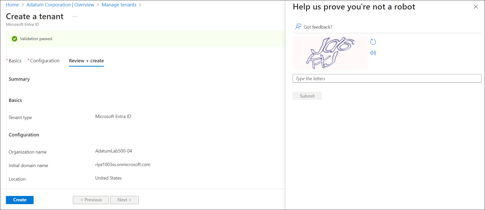
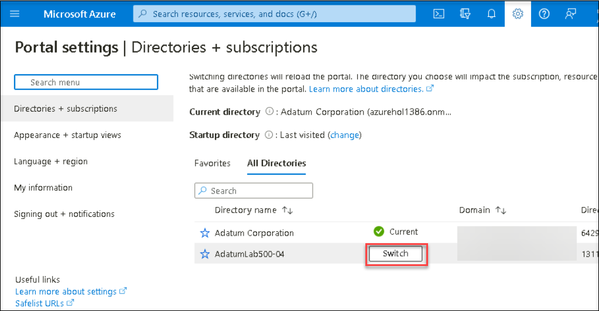
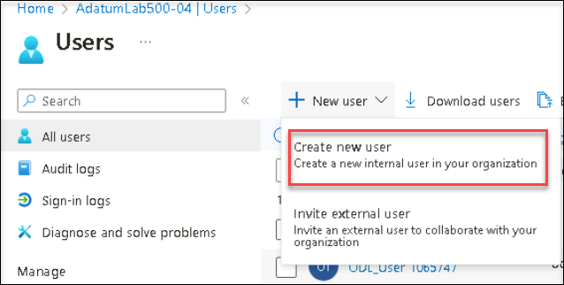

# Lab 05: Microsoft Entra ID Privileged Identity Management
# Student lab manual

## Lab scenario

You have been asked to create a proof of concept that uses Azure Privileged Identity Management (PIM) to enable just-in-time administration and control the number of users who can perform privileged operations. The specific requirements are:

- Create a permanent assignment of the aaduser2 Microsoft Entra ID user to the Security Administrator role. 
- Configure the aaduser2 Microsoft Entra ID user to be eligible for the Billing Administrator and Global Reader roles.
- Configure the Global Reader role activation to require an approval of the aaduser3 Microsoft Entra ID user
- Configure an access review of the Global Reader role and review auditing capabilities.

> For all the resources in this lab, we are using the **East US** region. Verify with your instructor this is the region to use for class. 

## Lab objectives

In this lab, you will complete the following exercises:

- Exercise 1: Configure PIM users and roles.
- Exercise 2: Activate PIM roles with and without approval.
- Exercise 3: Create an Access Review and review PIM auditing features.

## Architecture diagram

## Estimated timing: 40 minutes

### Exercise 1 - Configure PIM users and roles

In this exercise, you will complete the following tasks:

- Task 1: Create a new Microsoft Entra ID tenant.
- Task 2: Activate the Microsoft Entra ID Premium P2 trial.
- Task 3: Create Microsoft Entra ID users and groups.
- Task 4: Assign Microsoft Entra ID Premium P2 licenses to Microsoft Entra ID users
- Task 5: Make a user eligible for a role.
- Task 6: Configure a role to require approval to activate and add an eligible member.
- Task 7: Give a user permanent assignment to a role. 

#### Task 1: Create a new Microsoft Entra ID tenant

In this task, you will create a new Microsoft Entra ID tenant. 

1. In the Azure portal, in the **Search resources, services, and docs** text box at the top of the Azure portal page, type **Microsoft Entra ID** and  **Select** it.

2. On the blade displaying **Overview** of your current Microsoft Entra ID tenant, click on **Manage tenants**, and then on the next screen, click on **+ Create**.
   

   
3. On the **Basics** tab of the **Create a tenant** blade, ensure that the option **Microsoft Entra ID** is selected and click on **Next: Configuration >**.
4. On the **Configuration** tab of the **Create a tenant** blade, specify the following settings:

   |Setting|Value|
   |---|---|
   |Organization name|**AdatumLab500-04**|
   |Initial domain name|a unique name consisting of a combination of letters and digits|
   |Country or region|**United States**|

    >**Note**: Record the initial domain name. You will need it later in this lab.

5. Click on **Review + Create** and then click on **Create**.

6. Add Captcha code on **Help us prove you're not a robot** blade and then click on **Submit** button.

    >**Note**: Wait for the new tenant to be created. Use the **Notification** icon to monitor the deployment status. 

#### Task 2: Activate Microsoft Entra ID Premium P2 trial

In this task, you will sign up for the Microsoft Entra ID Premium P2 free trial. 

1. In the Azure portal, in the toolbar, click on the **Directories + subscriptions** icon, located to the right of the Cloud Shell icon. 

2. In the **Directories + subscriptions** blade, click on the newly created tenant, **AdatumLab500-04** and click on the **Switch** button to set it as the current directory.

    >**Note**: You may need to refresh the browser window if the **AdatumLab500-04** entry does not appear in the **Directories + subscriptions** filter list.

4. In the Azure portal, in the **Search resources, services, and docs** text box at the top of the Azure portal page, type **Microsoft Entra ID** and press the **Enter** key. On the **AdatumLab500-04** blade, in the **Manage** section, click on **Licenses**.

5. On the **Licenses \| Overview** blade, in the **Manage** section, click on **All products** and then click on **+ Try / Buy**.

6. On the **Activate** blade, in the **Microsoft Entra ID P2** section, click on **Free Trial** and then click on **Activate**.

#### Task 3: Create Microsoft Entra ID users

1. Navigate back to the **AdatumLab500-04** Microsoft Entra ID blade and, in the **Manage** section, click on **Users**.

1. On the **Users \| All users** blade, click on **+ New User** and then from the drop-down menu select **Create new user**

1. On the **Create new user** blade, in **basics** tab specify the following settings (leave all others with their default values):

   |Setting|Value|
   |---|---|
   |User principal name|**aaduser2**|
   |Display name|**aaduser2**|
   |Password|ensure that the option **Auto-generate password** is selected |
   
    >**Note**: Record the full user name and the password.
   
1. On the **Create new user** blade, select **Next: Properties**, in **Properties** tab under settings specify the following settings:
   |Setting|Value|
   |---|---|
   |Usage Location|**United States**|

1. Select **Review + create** and click on **Create**.

1. Back on the **Users \| All users** blade, click on **+ New User** and then from the drop-down menu select **Create new user**. 

1. Click on **Create new user** blade, in **basics** tab specify the following settings (leave all others with their default values):

   |Setting|Value|
   |---|---|
   |User principal name|**aaduser3**|
   |Display name|**aaduser3**|
   |Password|ensure that the option **Auto-generate password** is selected |
   
    >**Note**: Record the full user name and the password.

1. On the **Create new user** blade, select **Next: Properties**, in **Properties** tab under settings specify the following settings:
   
   |Setting|Value|
   |---|---|
   |Usage Location|**United States**|  

1. Select **Review + create** and click on **Create**.

    >**Note**: At this point, you should have three users listed on the **Users** page. 

#### Task 4: Assign Microsoft Entra ID Premium P2 licenses to Microsoft Entra ID users

In this task, you will assign each user to the Microsoft Entra ID Premium P2 license.

1. On the **Users \| All users** blade, click on the entry representing ODL_User <inject key="DeploymentID" enableCopy="false"/>. 

1. On the blade displaying the properties of your user account, click on **Edit properties**.

re.png)
   

1. In the **Settings** section, in the **Usage location** drop-down list, select the **United States** entry and click on **Save**.

.png)

1. Navigate back to the **AdatumLab500-04** Microsoft Entra ID blade and, in the **Manage** section, click on **Licenses**.

1. On the **Licenses \| Overview** blade, click on **All products**, select the **Microsoft Entra ID P2** checkbox, and click on **+ Assign**.

.png)

1. On the **Assign license** blade, click on **+ Add users and groups**.

1. On the **Add users and groups** blade, select  **aaduser2**, **aaduser3**, and **ODL_User <inject key="DeploymentID" enableCopy="false"/>** and click on **Select**.

1. Back on the **Assign license** blade, click on **Assignment options**, ensure that all options are enabled (on), click on **Review + assign**, and click on **Assign**.

    >**Note**: At this point, you assigned Microsoft Entra ID P2 license to all user accounts you will be using in this lab. Be sure to sign out and then sign back in. 

#### Task 5: Make a user eligible for a role

In this task, you will make a user eligible for an Azure AD directory role.

1. In the Azure portal, in the **Search resources, services, and docs** text box at the top of the Azure portal page, type **Azure AD Privileged Identity Management** and press the **Enter** key.

1. On the **Azure AD Privileged Identity Management** blade, in the **Manage** section, click on **Azure AD roles**.

.png)

1. On the **AdatumLab500-04 \| Quick start** blade, in the **Manage** section, click on **Roles**.

1. On the **AdatumLab500-04 \| Roles** blade, click on **+ Add assignments**.

.png)

1. On the **Add assignments** blade, in the **Select role** drop-down, select **Billing Administrator**.

.png)

1. Click the **No member selected** link, on the **Select a member** blade, click on **aaduser2**, and then click on **Select**.

1. Back on the **Add assignments** blade, click on **Next**.

-1.png)

1. Ensure the **Assignment type** is set to **Eligible** and click on **Assign**.
 
1. Back on the **AdatumLab500-04 \| Roles** blade, in the **Manage** section, click on **Assignments**.

1. Back on the **AdatumLab500-04 \| Assignments** blade, note the tabs for **Eligible assignments**, **Active assignments**, and **Expired assignments**.

1. Verify on the **Eligible assignments** tab that **aaduser2** is shown as a **Billing administrator**.

-1.png) 

    >**Note**: During sign-in, aaduser2 will be eligible to use the Billing administrator role. 

#### Task 6: Configure a role to require approval to activate and add an eligible member

1. In the Azure Portal, navigate back to the **Azure AD Privileged Identity Management** blade and click on **Azure AD roles**.

1. On the **AdatumLab500-04 \| Quick start** blade, in the **Manage** section, click on **Roles**.

1. On the **AdatumLab500-04 \| Roles** blade, search and select the **Global reader** role entry.

.png) 

1. On the **Global Reader \| Assignments** blade, click on **Settings** icon in the toolbar of the blade and review configuration settings for the role, including Azure Multi-Factor Authentication requirements.

1. Click on **Edit**.

.png) 

1. On the **Activation** tab, enable the **Require approval to activate** check box.

.png) 

1. Click **Select approvers(s)**, on the **Select a member** blade, click on **aaduser3**, and then click on **Select**.

1. Click on **Next: Assignment**.

1. Clear the **Allow permanent eligible assignment** check box, leaving all other settings with their default values.

.png) 

1. Click on **Next: Notification**.

1. Review the **Notification** settings, leave everything set by default and click on **Update**.

    >**Note**: Anyone trying to use the Global Reader role will now need approval from aaduser3. 

1. On the **Global Reader \| Assignments** blade, click on **+ Add assignments**.

.png) 

1. On the **Add assignments** blade, click on **No member selected**, on the **Select a member** blade, click on **aaduser2**, and then click on **Select**.

1. Click on **Next >**.

-1.png) 

1. Ensure the **Assignment type** is **Eligible** and review the eligible duration settings.

1. Click on **Assign**.

    >**Note**: User aaduser2 is eligible for the Global Reader role. 
 
#### Task 7: Give a user permanent assignment to a role

1. In the Azure Portal, navigate back to the **Azure AD Privileged Identity Management** blade and click on **Azure AD roles**.

1. On the **AdatumLab500-04 \| Quick start** blade, in the **Manage** section, click on **Roles**.

1. On the **AdatumLab500-04 \| Roles** blade, click on **+ Add assignments**.

.png)
   
1. On the **Add assignments** blade, in the **Select role** drop-down, select **Security Administrator**.
   
1. On the **Add assignments** blade, click the **No member selected**, on the **Select a member** blade, click on **aaduser2**, and then click on **Select**.

1. Click on **Next >**.
   
-1.png) 

1. Review the **Assignment type** settings is **Eligible** and click on **Assign**.

1. Back on the **AdatumLab500-04 \| Roles** blade, in the **Manage** section, click on **Assignments**.

1. Back on the **AdatumLab500-04 \| Assignments** blade, note the tabs for **Eligible assignments**, **Active assignments**, and **Expired assignments**.

1. On the **Assignments** page on the **Eligible Assignments** tab, under **Security Administrator** section, select **Update** for the **aaduser2** assignment. Select **Permanently Eligible** and **Save**.

    >**Note**: User aaduser2 is now permanently eligible for the Security Administrator role.
	
### Exercise 2 - Activate PIM roles with and without approval

#### Estimated timing: 15 minutes

In this exercise, you will complete the following tasks:

- Task 1: Activate a role that does not require approval. 
- Task 2: Activate a role that requires approval. 

#### Task 1: Activate a role that does not require approval

In this task, you will activate a role that does not require approval.

1. Open an InPrivate browser window.

1. In the InPrivate browser window, navigate to the **https://portal.azure.com/#home** and sign in using the **aaduser2** user account.

    >**Note**: To sign in you will need to provide a fully qualified name of the **aaduser2** user account, including the Microsoft Entra ID tenant DNS domain name, which you recorded earlier in this lab. This user name is in the format aaduser2@`<your_tenant_name>`.onmicrosoft.com, where `<your_tenant_name>` is the placeholder representing your unique Microsoft Entra ID tenant name.

    >**Note**: You will be prompted to **Update your password**, kindly update your password. 

1. In the Azure portal, in the **Search resources, services, and docs** text box at the top of the Azure portal page, type **Azure AD Privileged Identity Management** and press the **Enter** key.

1. On the **Azure AD Privileged Identity Management** blade, in the **Tasks** section, click on **My roles**.

1. You should see three **Eligible roles** for **aaduser2**: **Global Reader**, **Security Administrator**, and **Billing Administrator**.
   
.png)

1. In the row displaying the **Billing Administrator** role entry, click on **Activate**.

.png)

1. If needed, click the warning **Additional verification required. Click to continue** and follow the instructions to verify your identity.

   - In **Action Required** page, click on **Next**.
     
-1.png)
     
   - In **Keep your account secure** page, select the link **I want to set up a different method** and in Choose a different method, select phone option from the dropdown and click on **Confirm**.
     
.png)
     
   - In **Phone** page, please select your country and enter your phone number, make sure **Text me a code** is selected and click on **Next**.
   - Enter the code and click on **Next**.
   - Select **Next** and **Done**.

1. On the **Activate - Billing Administrator** blade, in the **Reason** text box, type a text providing justification for the activation, and then click on **Activate**.

    >**Note**: When you activate a role in PIM, it can take up to 10 minutes for the activation to take effect. 
	
    >**Note**: Once your role assignment is active, your browser will refresh (If anything goes wrong, simply sign out and sign back into the Azure portal by using the **aaduser2** user account).

1. Navigate back to the **Privileged Identity Management** blade and, in the **Tasks** section, click on **My roles**.

1. On the **My roles \| Azure AD roles** blade, switch to the **Active assignments** tab. Notice the **Billing Administrator** role is **Activated**.

    >**Note**: Once a role has been activated, it automatically deactivates when its time limit under **End time**(eligible duration) is reached.

    >**Note**: If you complete your administrator tasks early, you can deactivate a role manually.

1.  In the list of **Active Assignments**, in the row representing the Billing Administrator role, click the **Deactivate** link.

.png)

1.  On the **Deactivate - Billing Administrator** blade, click on **Deactivate** again to confirm.

.png)

   >**Note:** if it says **Deactivate role failed**, then you have to wait for 5 mins, and perform the step 11-12 again.

#### Task 2: Activate a role that requires approval

In this task, you will activate a role that requires approval.

1. In the InPrivate browser window, in the Azure portal, while signed in as the **aaduser2** user, navigate back to the **Privileged Identity Management \| Quick start** blade. 

1. On the **Privileged Identity Management \| Quick start** blade, in the **Tasks** section, click on **My roles**.

1. On the **My roles \| Microsoft Entra ID roles** blade, in the list of **Eligible assignments**, in the row displaying the **Global Reader** role, click on **Activate**.

.png)

1. On the **Activate - Global Reader** blade, in the **Reason** text box, type a text providing justification for the activation, and then click on **Activate**.

1. Click the **Notifications** icon in the toolbar of the Azure portal and view the notification informing that your request is pending for approval.

    >**Note**: As the Privileged role administrator you can review and cancel requests at any time. 

1. On the **My roles \| Azure AD roles** blade, locate the **Security Administrator** role, and click on **Activate**. 

1. If needed, Click the warning **Additional verification required. Click to continue**. 

1. Follow the instructions to verify your identity.

    >**Note**: You only have to authenticate once per session. 

1. Once you are back in the Azure Portal interface, on the **Activate - Security Administrator** blade, in the **Reason** text box, type a text providing justification for the activation, and then click on **Activate**.

    >**Note**: The auto approval process should complete.

1. Back on the **My roles \| Azure AD roles** blade, click the **Active assignments** tab and notice that the listing of **active assignments** includes **Security Administrator** but not the **Global Reader** role.

    >**Note**: You will now approve the Global Reader role.

1. Sign out of the Azure portal as **aaduser2**.

1. Sign into the Azure portal as **aaduser3**.

    >**Note**: If you run into problems with authenticating by using any of the user accounts, you can sign in to the Microsoft Entra ID tenant by using your user account to reset their passwords or reconfigure their sign-in options by disabling the User risk policy and Sign-in risk policy.

1. In the Azure portal, navigate to **Azure AD Privileged Identity Management**.

1. On the **Privileged Identity Management \| Quick start** blade, in the **Tasks** section, click on **Approve requests**.

1. On the **Approve requests \| Azure AD roles** blade, in the **Requests for role activations** section, select the checkbox for the entry representing the role activation request to the **Global Reader** role by **aaduser2**.

1. Click on **Approve**. On the **Approve Request** blade, in the **Justification** text box, type a reason for activation, note the start and end times, and then click on **Confirm**.

    >**Note**: You also have the option of denying requests.

1. Sign out of the Azure portal as **aaduser3**.

1. Sign into the Azure portal as **aaduser2**

1. In the Azure portal, navigate to **Azure AD Privileged Identity Management**.

1. On the **Privileged Identity Management \| Quick start** blade, in the **Tasks** section, click on **My roles**.

1. On the **My roles \| Azure AD roles** blade, click the **Active Assignments** tab and verify that the Global Reader role is now active.

    >**Note**: You might have to refresh the page to view the updated list of active assignments.

1. Sign out and close the InPrivate browser window.

> **Result**: You have practiced activating PIM roles with and without approval. 

### Exercise 3 - Create an Access Review and review PIM auditing features

#### Estimated timing: 10 minutes

In this exercise, you will complete the following tasks:

- Task 1: Configure security alerts for Azure AD directory roles in PIM
- Task 2: Review PIM alerts, summary information, and detailed audit information

#### Task 1: Configure security alerts for Azure AD directory roles in PIM

In this task, you will reduce the risk associated with "stale" role assignments. You will do this by creating a PIM access review to ensure that assigned roles are still valid. Specifically, you will review the Global Reader role. 

1. Navigate back to Azure portal Sign-in with your account.

    >**Note**: Ensure that you are signed-in to the **AdatumLab500-04** Microsoft Entra ID tenant. You can use the **Directory + subscription** filter to switch between Microsoft Entra ID tenants. Ensure you are signed in as a user with the Global Administrator role.
    
    >**Note**: If you still don't see the AdatumLab500-04 entry, click on the Switch Directory link, select the AdatumLab500-04 line and click the Switch button.

1. In the Azure portal, in the **Search resources, services, and docs** text box at the top of the Azure portal page, type **Azure AD Privileged Identity Management** and press the **Enter** key.

1. On the **Privileged Identity Management \| Quick start** blade, in the **Manage** section, click on **Azure AD Roles**.

1. On the **AdatumLab500-04 \| Quick start** blade, in the **Manage** section, click on **Access reviews**.

1. On the **AdatumLab500-04 \| Access reviews** blade, click on **New**.

.png)

1. On the **Create an access review** blade, specify the following settings (leave others with their default values): 

   |Setting|Value|
   |---|---|
   |Review name|**Global Reader Review**|
   |Start Date|today's date| 
   |Frequency|**One time**|
   |End Date|end of the current month|
   |Role > Select Privileged Role(s)|**Global Reader**|
   |Reviewers|**Select users(s) or group(s)**|
   |Select reviewers|ODL_User <inject key="DeploymentID" enableCopy="false"/>|

1. On the **Create an access review** blade, click on **Start**.
 
    >**Note**: It will take about a minute for the review to deploy and appear on the **AdatumLab500-04 \| Access reviews** blade. You might have to refresh the web page. The review status will be **Active**. 

1. On the **AdatumLab500-04 \| Access reviews** blade, under the **Global Reader Review** header, select the **Global Reader** entry. 

1. On the **Access review details** blade, examine the **Overview** page and note that the **Progress** charts shows a single users in the **Not reviewed** category. 

1. On the **Access review details** blade, in the **Manage** section, click on **Results**. Note that aaduser2 is listed as having access to this role.

1. Click on **view** on **aaduser2** line to view a detailed audit log with entries representing PIM activities that involve that user.
    
.png)

1. Navigate back to the **AdatumLab500-04 \| Access reviews** blade.

1. On the the **AdatumLab500-04 \| Access reviews** blade, in the **Tasks** section, click on **Review access** and then, select the **Global Reader Review** entry. 

1. On the **Global Reader Review** blade, select **aaduser2** entry. 

1. In the **Reason** text box, type a reason for approval and then click either **Approve** to maintain the current role membership or **Deny** to revoke it.
   
.png) 

1. Navigate back to the **Privileged Identity Management** blade and, in the **Manage** section, click on **Azure AD roles**.

1. On the **AdatumLab500-04 \| Quick start** blade, in the **Manage** section, click on **Access reviews**.

1. Select the entry representing the **Global Reader** review. Note that the **Progress** chart. 

#### Task 2: Review PIM alerts, summary information, and detailed audit information 

In this task, you will review PIM alerts, summary information, and detailed audit information. 

1. Navigate back to the **Privileged Identity Management** blade and, in the **Manage** section, click on **Azure AD roles**.

1. On the **AdatumLab500-04 \| Quick start** blade, in the **Manage** section, click on **Alerts**, and then click on **Setting**. 

1. On the **Alert settings** blade, review the preconfigured alerts and risk levels. Click on any of them for more detailed information.
    
.png) 

1. Return to the **AdatumLab500-04 \| Quick start** blade and click on **Overview**. 

1. On the **AdatumLab500-04 \| Overview** blade, review summary information about role activations, PIM activities, alerts, and role by assignment.

1. On the **AdatumLab500-04 \| Overview** blade, in the **Activity** section, click on **Resource audit**. 

    >**Note**: Audit history is available for all privileged role assignments and activations within the past 30 days.

1. Notice you can retrieve detailed information, including **Time**, **Requestor**, **Action**, **Resource name**, **Scope**, **Primary Target** and **Subject**. 

> **Result:** You have configured an access review and reviewed audit information.

> **Congratulations** on completing the task! Now, it's time to validate it. Here are the steps:
- Click the Lab Validation tab located at the upper right corner of the lab guide section and navigate to the Lab Validation Page.
- Hit the Validate button for the corresponding task. If you receive a success message, you can proceed to the next task. 
- If not, carefully read the error message and retry the step, following the instructions in the lab guide.
- If you need any assistance, please contact us at labs-support@spektrasystems.com. We are available 24/7 to help you out.

## Review

In this lab, you have:

- Configured PIM users and roles.
- Activated PIM roles with and without approval.
- Created an Access Review and review PIM auditing features.

## You have successfully completed the lab

