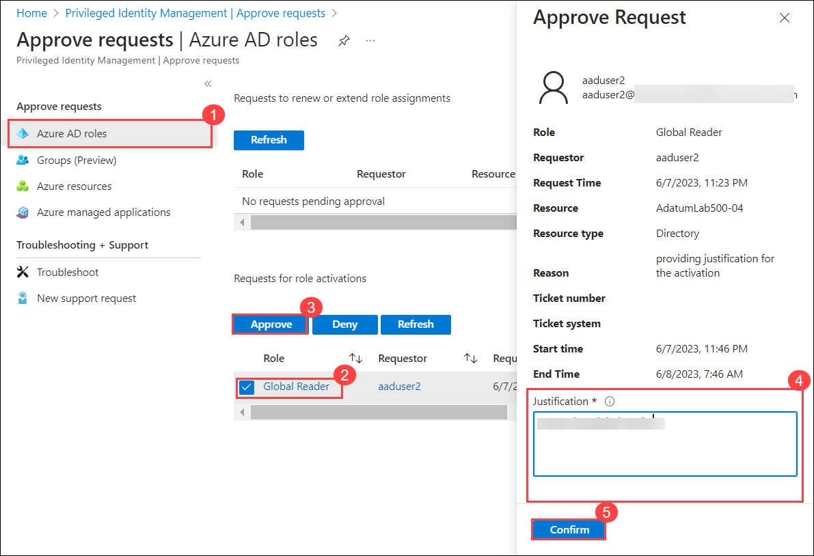
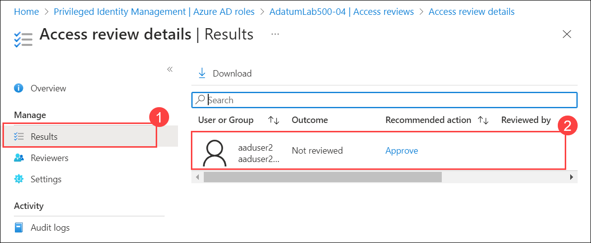
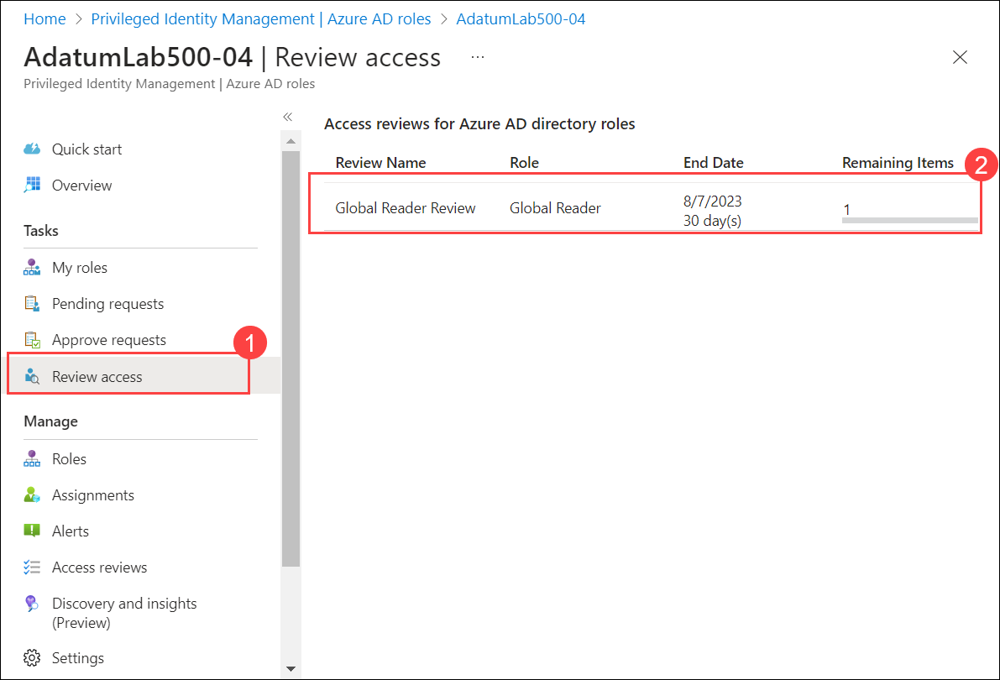

# Lab 05: Azure AD Privileged Identity Management

## Lab scenario
You have been asked to create a proof of concept that uses Azure Privileged Identity Management (PIM) to enable just-in-time administration and control the number of users who can perform privileged operations. The specific requirements are:
- Create a permanent assignment of the aaduser2 Azure AD user to the Security Administrator role. 
- Configure the aaduser2 Azure AD user to be eligible for the Billing Administrator and Global Reader roles.
- Configure the Global Reader role activation to require an approval of the aaduser3 Azure AD user
- Configure an access review of the Global Reader role and review auditing capabilities.

> Before you proceed, ensure that you have completed Lab 04: MFA, Conditional Access and AAD Identity Protection . You will need the Azure AD tenant, AdatumLab500-04, and the aaduser1, aaduser2, and aaduser3 user accounts.

## Lab objectives
In this lab, you will complete the following exercises:
- Exercise 1: Configure PIM users and roles.
- Exercise 2: Activate PIM roles with and without approval.
- Exercise 3: Create an Access Review and review PIM auditing features.

## Architecture Diagram

## Exercise 1 - Configure PIM users and roles

### Estimated timing: 15 minutes

In this exercise, you will complete the following tasks:

- Task 1: Make a user eligible for a role.
- Task 2: Configure a role to require approval to activate and add an eligible member.
- Task 3: Give a user permanent assignment to a role. 

### Task 1: Make a user eligible for a role

In this task, you will make a user eligible for an Azure AD directory role.

1. Ensure that you are signed-in to the **AdatumLab500-04** Azure AD tenant. You can use the **Directory + subscription** filter to switch between Azure AD tenants. Ensure you are signed in as a user with the Global Administrator role.
    
    >**Note**: If you still don't see the AdatumLab500-04 entry, click on the Switch Directory link, select the AdatumLab500-04 line and click the Switch button.

1. In the Azure portal, in the **Search resources, services, and docs** text box at the top of the Azure portal page, type **Azure AD Privileged Identity Management** and press the **Enter** key.

1. On the **Azure AD Privileged Identity Management** blade, in the **Manage** section, click on **Azure AD roles**.

1. On the **AdatumLab500-04 \| Quick start** blade, in the **Manage** section, click on **Roles**.

1. On the **AdatumLab500-04 \| Roles** blade, click on **+ Add assignments**.

1. On the **Add assignments** blade, in the **Select role** drop-down, select **Billing Administrator (1)**.

1. Under Select member(s), click the **No member selected (2)** link, on the **Select a member** blade, click on **aaduser2 (3)**, and then click on **Select (4)**.

    .png)

1. Back on the **Add assignments** blade, click on **Next**. 

1. Ensure the **Assignment type** is set to **Eligible** and click on **Assign**.
 
1. Back on the **AdatumLab500-04 \| Roles** blade, in the **Manage** section, click on **Assignments**.

1. Back on the **AdatumLab500-04 \| Assignments (1)** blade, note the tabs for **Eligible assignments (2)**, **Active assignments (3)**, and **Expired assignments (4)**.

    

1. Verify on the **Eligible assignments** tab that **aaduser2** is shown as a **Billing administrator**. 

    >**Note**: During sign-in, aaduser2 will be eligible to use the Billing administrator role. 

### Task 2: Configure a role to require approval to activate and add an eligible member

1. In the Azure Portal, navigate back to the **Azure AD Privileged Identity Management** blade and click on **Azure AD roles**.

1. On the **AdatumLab500-04 \| Quick start** blade, in the **Manage** section, click on **Roles**.

1. On the **AdatumLab500-04 \| Roles** blade, click the **Global reader** role entry. 

    

1. On the **Global Reader \| Assignments** blade, click on **Settings** icon in the toolbar of the blade and review configuration settings for the role, including Azure Multi-Factor Authentication requirements.

1. Click on **Edit**.

1. On the **Activation** tab, enable the **Require approval to activate (1)** check box.

1. Click **Select approvers(s) (2)**, on the **Select a member** blade, click on **aaduser3 (3)**, and then click on **Select**, click on **Next:Assignment (4)**.

    .png)

1. Clear the **Allow permanent eligible assignment** check box, leaving all other settings with their default values.

1. Click on **Next:Notification**.

1. Review the **Notification** settings, leave everything set by default and click on **Update**.

    >**Note**: Anyone trying to use the Global Reader role will now need approval from aaduser3. 

1. On the **Global Reader \| Assignments** blade, click on **+ Add assignments**.

1. On the **Add assignments** blade, click on **No member selected**, on the **Select a member** blade, click on **aaduser2**, and then click on **Select**.

1. Click on **Next**. 

1. Ensure the **Assignment type** is **Eligible** and review the eligible duration settings.

16. Click on **Assign**.

    >**Note**: User aaduser2 is eligible for the Global Reader role. 
 
### Task 3: Give a user permanent assignment to a role.

1. In the Azure Portal, navigate back to the **Azure AD Privileged Identity Management** blade and click on **Azure AD roles**.

1. On the **AdatumLab500-04 \| Quick start** blade, in the **Manage** section, click on **Roles**.

1. On the **AdatumLab500-04 \| Roles** blade, click on **+ Add assignments**.

1. On the **Add assignments** blade, in the **Select role** drop-down, select **Security Administrator**.

1. On the **Add assignments** blade, click the **No member selected**, on the **Select a member** blade, click on **aaduser2**, and then click on **Select**.

1. Click on **Next**. 

1. Review the **Assignment type** settings and click on **Assign**.

1. From left navigation pane, Select **Assignments** under **Manage**.

1. On the **Assignments** page on the **Eligible Assignments** tab, select **Update** for the **aaduser2** assignment. Select **Permanently Eligible** and **Save**.

    >**Note**: User aaduser2 is now permanently eligible for the Security Administrator role.
	
## Exercise 2 - Activate PIM roles with and without approval

### Estimated timing: 15 minutes

In this exercise, you will complete the following tasks:

- Task 1: Activate a role that does not require approval. 
- Task 2: Activate a role that requires approval. 

### Task 1: Activate a role that does not require approval.

In this task, you will activate a role that does not require approval.

1. Open an InPrivate browser window.

1. In the InPrivate browser window, navigate to the Azure portal and sign in using the **aaduser2** user account.

    >**Note**: To sign in you will need to provide a fully qualified name of the **aaduser2** user account, including the Azure AD tenant DNS domain name, which you recorded earlier in this lab. This user name is in the format aaduser2@`<your_tenant_name>`.onmicrosoft.com, where `<your_tenant_name>` is the placeholder representing your unique Azure AD tenant name. 

1. In the Azure portal, in the **Search resources, services, and docs** text box at the top of the Azure portal page, type **Azure AD Privileged Identity Management** and press the **Enter** key.

1. On the **Azure AD Privileged Identity Management** blade, in the **Tasks** section, click on **My roles**.

1. You should see three **Eligible roles** for **aaduser2**: **Global Reader**, **Security Administrator**, and **Billing Administrator**. 

1. In the row displaying the **Billing Administrator** role entry, click on **Activate**.

1. If needed, click the warning **Additional verification required. Click to continue** and follow the instructions to verify your identity.

1. On the **Activate - Billing Administrator** blade, in the **Reason** text box, type a text providing justification for the activation, and then click on **Activate**.

    >**Note**: When you activate a role in PIM, it can take up to 10 minutes for the activation to take effect. 
	
    >**Note**: Once your role assignment is active, your browser will refresh (If anything goes wrong, simply sign out and sign back into the Azure portal by using the **aaduser2** user account).

1. Navigate back to the **Azure AD Privileged Identity Management** blade and, in the **Tasks** section, click on **My roles**.

1. On the **My roles \| Azure AD roles** blade, switch to the **Active assignments** tab. Notice the **Billing Administrator** role is **Activated**.

    >**Note**: Once a role has been activated, it automatically deactivates when its time limit under **End time**(eligible duration) is reached.

    >**Note**: If you complete your administrator tasks early, you can deactivate a role manually.

1.  In the list of **Active Assignments**, in the row representing the Billing Administrator role, click the **Deactivate** link.

1.  On the **Deactivate - Billing Administrator** blade, click on **Deactivate** again to confirm.

### Task 2: Activate a role that requires approval. 

In this task, you will activate a role that requires approval.

1. In the InPrivate browser window, in the Azure portal, while signed in as the **aaduser2** user, navigate back to the **Privileged Identity Management \| Quick start** blade. 

1. On the **Privileged Identity Management \| Quick start** blade, in the **Tasks** section, click on **My roles**.

1. On the **My roles \| Azure AD roles** blade, in the list of **Eligible assignments**, in the row displaying the **Global Reader** role, click on **Activate**. 

1. On the **Activate - Global Reader** blade, in the **Reason** text box, type a text providing justification for the activation, and then click on **Activate**.

1. Click the **Notifications** icon in the toolbar of the Azure portal and view the notification informing that your request is pending approval.

    >**Note**: As the Privileged role administrator you can review and cancel requests at any time. 

1. On the **My roles \| Azure AD roles** blade, locate the **Security Administrator** role, and click on **Activate**. 

1. If warning is displayed, click the warning **Additional verification required. Click to continue**. 

1. Follow the instructions to verify your identity.

    >**Note**: You only have to authenticate once per session. 

1. Once you are back in the Azure Portal interface, on the **Activate - Security Administrator** blade, in the **Reason** text box, type a text providing justification for the activation, and then click on **Activate**.

    >**Note**: The auto approval process should complete.

1. Back on the **My roles \| Azure AD roles** blade, click the **Active assignments** tab and notice that the listing of **active assignments** includes **Security Administrator** but not the **Global Reader** role.

    >**Note**: You will now approve the Global Reader role.

1. Sign out of the Azure portal as **aaduser2**.

1. Sign into the Azure portal as **aaduser3**.

    >**Note**: If you run into problems with authenticating by using any of the user accounts, you can sign in to the Azure AD tenant by using your user account and  navigate to Azure AD identity protection reconfigure their sign-in options by disabling **Enforcement Policy** of User risk policy and Sign-in risk policy, if prompted kindly updated you're password and sign in to Azure portal

1. In the Azure portal, navigate to **Azure AD Privileged Identity Management**.

1. On the **Privileged Identity Management \| Quick start** blade, in the **Tasks** section, click on **Approve requests**.

1. On the **Approve requests \| Azure AD roles** blade, in the **Requests for role activations** section, select the checkbox for the entry representing the role activation request to the **Global Reader** role by **aaduser2**.

1. Click on **Approve** and on the **Approve Request** blade, in the **Justification** text box, type a reason for activation, note the start and end times, and then click on **Confirm**. 

    

    >**Note**: You also have the option of denying requests.

1. Sign out of the Azure portal as **aaduser3**.

1. Sign into the Azure portal as **aaduser2**

1. In the Azure portal, navigate to **Azure AD Privileged Identity Management**.

1. On the **Privileged Identity Management \| Quick start** blade, in the **Tasks** section, click on **My roles**.

1. On the **My roles \| Azure AD roles** blade, click the **Active Assignments** tab and verify that the Global Reader role is now active.

    >**Note**: You might have to refresh the page to view the updated list of active assignments.

1. Sign out and close the InPrivate browser window.

> Result: You have practiced activating PIM roles with and without approval. 

## Exercise 3 - Create an Access Review and review PIM auditing features

### Estimated timing: 10 minutes

In this exercise, you will complete the following tasks:

- Task 1: Configure security alerts for Azure AD directory roles in PIM
- Task 2: Review PIM alerts, summary information, and detailed audit information

### Task 1: Configure security alerts for Azure AD directory roles in PIM

In this task, you will reduce the risk associated with "stale" role assignments. You will do this by creating a PIM access review to ensure that assigned roles are still valid. Specifically, you will review the Global Reader role. 

1. Sign-in to the Azure portal **`https://portal.azure.com/`** using your account.

    >**Note**: Ensure that you are signed-in to the **AdatumLab500-04** Azure AD tenant. You can use the **Directory + subscription** filter to switch between Azure AD tenants. Ensure you are signed in as a user with the Global Administrator role.
    
    >**Note**: If you still don't see the AdatumLab500-04 entry, click on the Switch Directory link, select the AdatumLab500-04 line and click the Switch button.

1. In the Azure portal, in the **Search resources, services, and docs** text box at the top of the Azure portal page, type **Azure AD Privileged Identity Management** and press the **Enter** key.

1. Navigate to the **Azure AD Privileged Identity Management** blade. 

1. On the **Privileged Identity Management \| Quick start** blade, in the **Manage** section, click on **Azure AD Roles**.

1. On the **AdatumLab500-04 \| Quick start** blade, in the **Manage** section, click on **Access reviews**.

1. On the **AdatumLab500-04 \| Access reviews** blade, click on **New**.

1. On the **Create an access review** blade, specify the following settings (leave others with their default values): 

   |Setting|Value|
   |---|---|
   |Review name|**Global Reader Review**|
   |Start Date|today's date| 
   |Frequency|**One time**|
   |End Date|end of the current month|
   |Role, Select Privileged Role(s)|**Global Reader**|
   |Reviewers|**Selected user(s) or group(s)**|
   |Select reviewers|your account|

1. On the **Create an access review** blade, click on **Start**.
 
    >**Note**: It will take about a minute for the review to deploy and appear on the **AdatumLab500-04 \| Access reviews** blade. You might have to refresh the web page. The review status will be **Active**. 

1. On the **AdatumLab500-04 \| Access reviews** blade, under the **Global Reader Review** header, click the **Global Reader** entry. 

    .png)

1. On the **Access review details** blade, examine the **Overview** page and note that the **Progress** charts shows a single users in the **Not reviewed** category. 

1. On the **Access review details** blade, in the **Manage** section, click on **Results**. Note that aaduser2 is listed as having access to this role.
 
    

1. Click on **view** on **aaduser2** line to view a detailed audit log with entries representing PIM activities that involve that user.

1. Navigate back to the **AdatumLab500-04 \| Access reviews** blade.

1. On the the **AdatumLab500-04 \| Access reviews** blade, in the **Tasks** section, click on **Review access** and then, click the **Global Reader Review** entry. 
   
   

1. On the **Global Reader Review** blade, click the **aaduser2** entry. 

1. In the **Reason** text box, type a rationale for approval and then click either **Approve** to maintain the current role membership or **Deny** to revoke it. 

   .png)

1. Navigate back to the **Azure AD Privileged Identity Management** blade and, in the **Manage** section, click on **Azure AD roles**.

1. On the **AdatumLab500-04 \| Quick start** blade, in the **Manage** section, click on **Access reviews**.

1. Select the entry representing the **Global Reader** review. Note that the **Progress** chart has been updated to show your review. 

### Task 2: Review PIM alerts, summary information, and detailed audit information. 

In this task, you will review PIM alerts, summary information, and detailed audit information. 

1. Navigate back to the **Azure AD Privileged Identity Management** blade and, in the **Manage** section, click on **Azure AD roles**.

1. On the **AdatumLab500-04 \| Quick start** blade, in the **Manage** section, click on **Alerts**, and then click on **Setting**.

1. On the **Alert settings** blade, review the pre-configured alerts and risk levels. Click on any of them for more detailed information. 

1. Return to the **AdatumLab500-04 \| Quick start** blade and click on **Overview**. 

1. On the **AdatumLab500-04 \| Overview** blade, review summary information about role activations, PIM activities, alerts, and role assignments.

1. On the **AdatumLab500-04 \| Overview** blade, in the **Activity** section, click on **Resource audit**. 

    >**Note**: Audit history is available for all privileged role assignments and activations within the past 30 days.

1. Notice you can retrieve detailed information, including **Time**, **Requestor**, **Action**, **Resource name**, **Scope**, **Primary Target** and **Subject**. 

> Result: You have configured an access review and reviewed audit information.

**You have successfully completed the lab. Please click on next to go to the next lab.**
