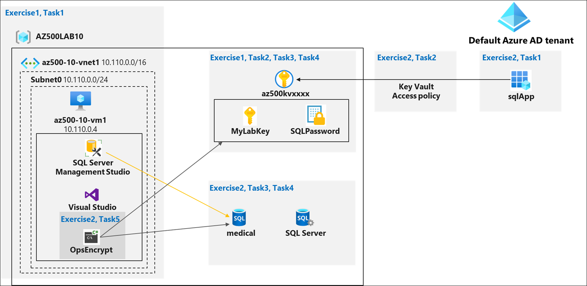

# Lab Scenario Preview: AZ-500: Secure Data and Applications

## Lab 10: Key Vault (Implementing Secure Data by setting up Always Encrypted)

### Lab overview

You have been asked to create a proof of concept application that makes use of the Azure SQL Database support for Always Encrypted functionality. All of the secrets and keys used in this scenario should be stored in Key Vault. The application should be registered in Microsoft Entra ID in order to enhance its security posture. To accomplish these objectives, the proof of concept should include:
- Creating an Azure Key Vault and storing keys and secrets in the vault.
- Create a SQL Database and encrypting content of columns in database tables by using Always Encrypted.

>**Note**: For all the resources in this lab, we are using the **East US** region. Verify with your instructor this is the region to use for class. 

To keep the focus on the security aspects of Azure, related to building this proof of concept, you will start from an automated ARM template deployment, setting up a Virtual Machine with Visual Studio 2019 and SQL Server Management Studio 2019.

### Objectives

In this lab, you will complete the following exercises:
- Exercise 1: Deploy the base infrastructure from an ARM template.
- Exercise 2: Configure the Key Vault resource with a key and a secret.
- Exercise 3: Configure an Azure SQL database and a data-driven application.
- Exercise 4: Demonstrate the use of Azure Key Vault in encrypting the Azure SQL database.

### Architecture Diagram

Once you understand the lab's content, you can start the Hands-on Lab by clicking the **Launch** button located in the top right corner. This will lead you to the lab environment and guide. You can also preview the full lab guide [here](https://experience.cloudlabs.ai/#/labguidepreview/1ad64207-9f75-4958-9b44-aa4bcf63d18f) if you want to go through detailed guide prior to launching lab environment.
