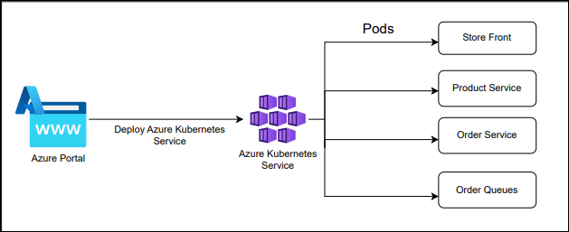
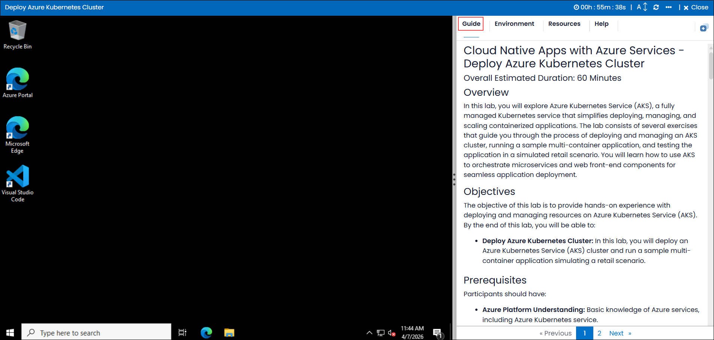
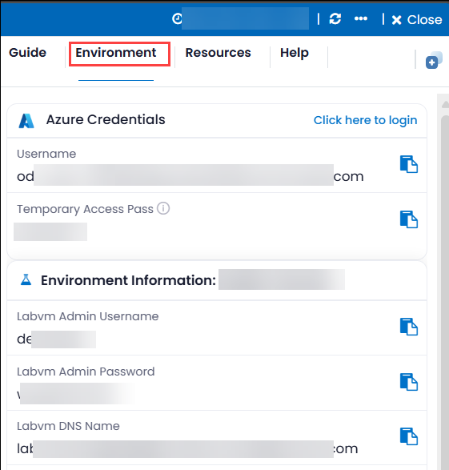
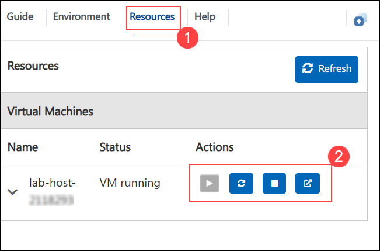
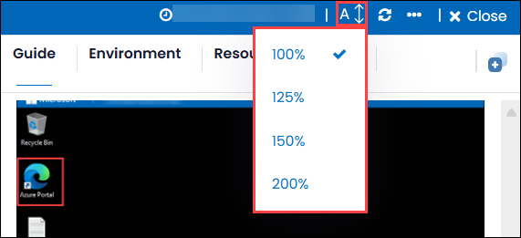
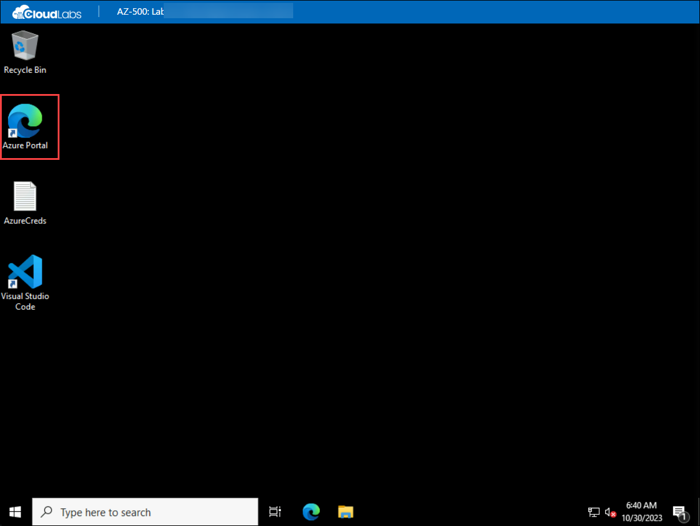
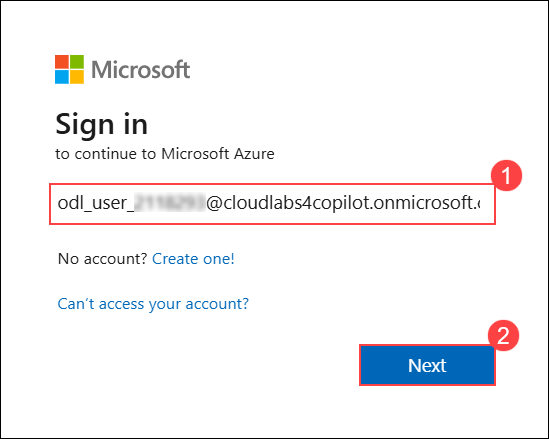
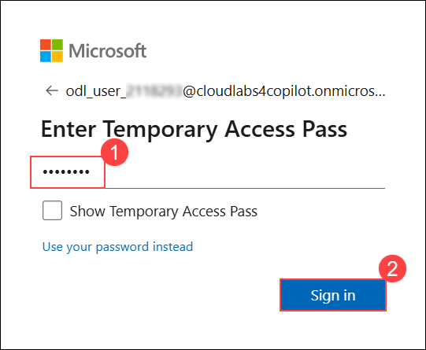
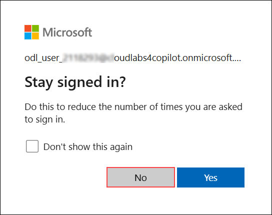

# Cloud Native Apps with Azure Services - Deploy Azure Kubernetes Cluster

### Overall Estimated Duration: 60 Minutes

## Overview

In this lab, you will explore Azure Kubernetes Service (AKS), a fully managed Kubernetes service that simplifies deploying, managing, and scaling containerized applications. The lab consists of several exercises that guide you through the process of deploying and managing an AKS cluster, running a sample multi-container application, and testing the application in a simulated retail scenario. You will learn how to use AKS to orchestrate microservices and web front-end components for seamless application deployment.

## Objectives

The objective of this lab is to provide hands-on experience with deploying and managing resources on Azure Kubernetes Service (AKS). By the end of this lab, you will be able to:

- **Deploy Azure Kubernetes Cluster:** In this lab, you will deploy an Azure Kubernetes Service (AKS) cluster and run a sample multi-container application simulating a retail scenario.

## Prerequisites

Participants should have:

- **Azure Platform Understanding:** Basic knowledge of Azure services, including Azure Kubernetes Service.

- **Basic Knowledge of Kubernetes:** A basic understanding of Kubernetes concepts such as pods, containers, deployments, and services.

## Architechture

This architecture illustrates the flow of deploying and managing a multi-container application using Azure Kubernetes Service (AKS). The process begins with the Azure Portal, where an AKS cluster is created and configured. Within the AKS cluster, multiple components are deployed as separate pods, including the storefront, product service, order service, and order queue. These microservices work together to simulate a retail scenario, with each service running independently but communicating seamlessly within the Kubernetes environment. The architecture ensures scalability, high availability, and efficient management of containerized applications in the cloud.

## Architecture Diagram

## Explanation of Components

- **Azure Kubernetes Service (AKS):** A fully managed Kubernetes service that provides a platform for deploying and managing containerized applications.

- **Pods:** A pod is the smallest deployable unit in Kubernetes, consisting of one or more containers that share the same resources, such as networking and storage.

## Getting Started with Lab
 
Welcome to your Cloud Native Apps with Azure Services! We've prepared a seamless environment for you to explore and learn Azure Security Technologies. Let's begin by making the most of this experience:

## Accessing Your Lab Environment
 
Once you're ready to dive in, your virtual machine and lab guide will be right at your fingertips within your web browser.
 

### Virtual Machine & Lab Guide
 
Your virtual machine is your workhorse throughout the workshop. The lab guide is your roadmap to success.
 
## Exploring Your Lab Resources
 
To get a better understanding of your lab resources and credentials, navigate to the **Environment Details** tab.
 

 
## Utilizing the Split Window Feature
 
For convenience, you can open the lab guide in a separate window by selecting the **Split Window** button from the top right corner.
 

 
## Managing Your Virtual Machine
 
Feel free to start, stop, or restart your virtual machine as needed from the **Resources** tab. Your experience is in your hands!
 

## Lab Guide Zoom In/Zoom Out

To adjust the zoom level for the environment page, click the **A↕ : 100%** icon located next to the timer in the lab environment.

1. If you have not extended the duration prior to when the lab is about to end, a pop-up will appear, giving you the option to extend. Click **OK** to proceed.
     
## Let's Get Started with Azure Portal
 
1. On your virtual machine, click on the Azure Portal icon as shown below:
 
    
 
1. You'll see the **Sign into Microsoft Azure** tab. Here, enter your credentials:
 
   - **Email:** <inject key="AzureAdUserEmail"></inject>
 
      
 
1. Next, provide the **Temporary Access Pass**:
 
   - **Temporary Access Pass:** <inject key="AzureAdUserPassword"></inject>
 
     
 
1. If prompted to stay signed in, you can click "No."

    
 
1. If a **Welcome to Microsoft Azure** pop-up window appears, simply click **Cancel** to skip the tour.

## Support Contact

The CloudLabs support team is available 24/7, 365 days a year, via email and live chat to ensure seamless assistance at any time. We offer dedicated support channels tailored specifically for both learners and instructors, ensuring that all your needs are promptly and efficiently addressed.

Learner Support Contacts:

- Email Support: cloudlabs-support@spektrasystems.com

- Live Chat Support: https://cloudlabs.ai/labs-support
   
Now, click on Next from the lower right corner to move to the next page.

### Happy Learning!!
 

